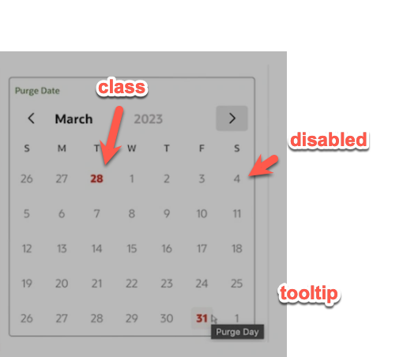
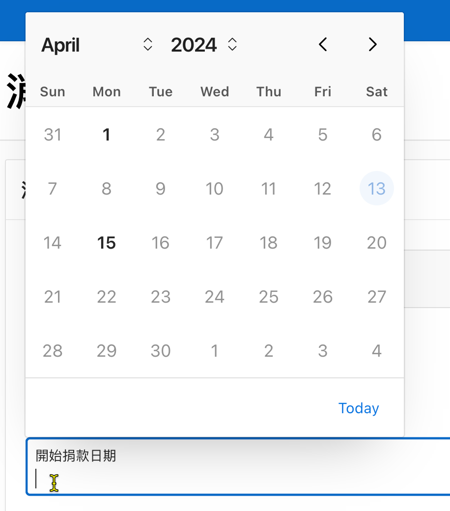
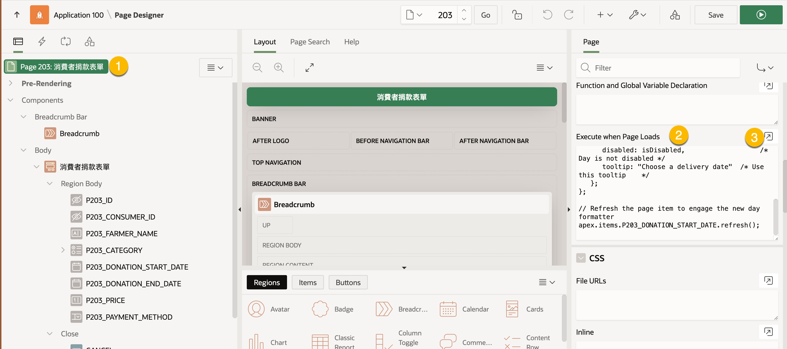
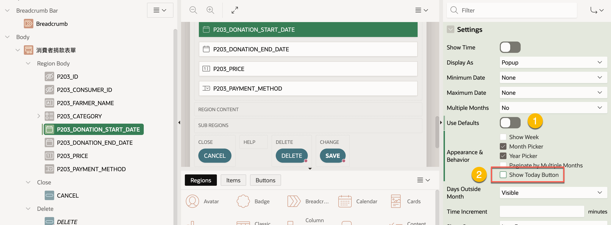

# Date Picker 限制可選擇的日期

## User Story

在「捐款表單」上，使用者在選擇捐款日期時，只能選擇每月的 1 或 15 號。

使用 Date Picker 元件，限制使用者在選擇日期時，只能選擇特定的日期，例如每月的 1 或 15 號。


## 技術原理

### 使用 Format Date Picker Days plug-in
可使用 `Format Date Picker Days` plug-in[2] 使用 SQL query 或者 ICS calendar file 來設定 day picker 中的月天的格式。

例如, 將某些月天設定為不可選擇，或者設定某些月天的提示訊息。


### 使用 JavaScript

若不用 plug-in，也可以使用 JavaScript 來設定 day picker 中的月天的格式。

自 Apex 22.2 開始, Date Picker 可以接受 `dayFormatter` function 來設定 day picker 中的月天的格式。


做法如下:

```js
apex.items.[date_picker_item_name].dayFormatter = function (pCurrentDate) {
   // Your code here
   return {
      disabled: false,                   /* Day is not disabled */
      class: "your_custom_class",        /* Add a custom class */
      tooltip: "Choose a delivery date"  /* Use this tooltip    */
   };
};

// Refresh the page item to engage the new day formatter
apex.items.[date_picker_item_name].refresh();
```

這段程式碼放在頁面的 `Execute when Page Loads` 屬性中，當頁面載入時，即會執行。

執行時, Date Picker 的每一個月天都會呼叫 `dayFormatter` function 來設定格式。呼叫時，傳入 `pCurrentDate` 字串，代表當前的日期 

使用 `apex.date.parse` 來將 `pCurrentDate` 字串轉換為 [Date](https://developer.mozilla.org/en-US/docs/Web/JavaScript/Reference/Global_Objects/Date) 物件。

若要取得日期的月天(1-31)，可以使用 `getDate()` 方法; 若要取得週天(Sunday(0) ~ Saturday(6))，可以使用 `getDay()` 方法。

該函數回傳一個資料物件，包含以下屬性:

- `disabled`: 是否停用該日期，若為 `true`，則該日期無法選擇。
- `class`: 日期的 CSS class 名稱，可用來套用自訂的 CSS 樣式。
- `tooltip`: 日期的提示訊息。



Fig source: [1]


## 實作步驟

在 `捐款表單` 上，有一個日期欄位 `P203_DONATION_START_DATE`，使用者在選擇捐款日期時，只能選擇每月的 1 或 15 號。



S1. 在 Page Designer 中編輯該頁面。

S2. 在頁面屬性 `Execute when Page Loads` 中，新增以下 JavaScript 代碼:

```js
apex.items.P203_DONATION_START_DATE.dayFormatter = function (pCurrentDate) {
   // pCurrentDate is string
   const curDate = apex.date.parse(pCurrentDate,"YYYY-MM-DD");
   // 預設停用月天
   let isDisabled = true;
   // 若為每月的 1 或 15 號，則不停用
   if ( curDate.getDate() == 1 || curDate.getDate() == 15){
       isDisabled = false;
   }
   //console.log(curDate.getDate(), ' ', curDate.getDay(),  ' ', isDisabled)
   return {
      disabled: isDisabled,                   /* Day is not disabled */
      tooltip: "選擇捐款開始日期"  /* Use this tooltip    */
   };
};

// Refresh the page item to engage the new day formatter
apex.items.P203_DONATION_START_DATE.refresh();
```



S3. 停用 Date Picker 的 Today 按鈕，避免使用者選擇不合法的日期。



S4. 點選 Save 按鈕, 儲存頁面並測試。

當使用者在選擇日期時，只能選擇每月的 1 或 15 號。

## 總結

我們可以使用 `dayFormatter` function 來設定 Date Picker 中的月天的格式，例如限制使用者在選擇日期時，只能選擇每月的 1 或 15 號。

`dayFormatter` function 會在 Date Picker 中的每一個月天被呼叫，並回傳一個資料物件，包含 `disabled`, `class`, `tooltip` 等屬性。

也可以使用 `Format Date Picker Days` plug-in 來設定 day picker 中的月天的格式。這個就是一個更簡單的方法，不需要寫 JavaScript 代碼。有興趣的讀者可以參考 [2]


## 參考資料

1. [Muench, S., 2023. Custom Date Picker Formatting](https://diveintoapex.com/2023/01/30/custom-date-picker-formatting/)
2. [apex/plugins/dynamic-action/format-datepicker-days at 23.2 · oracle/apex](https://github.com/oracle/apex/tree/23.2/plugins/dynamic-action/format-datepicker-days)
