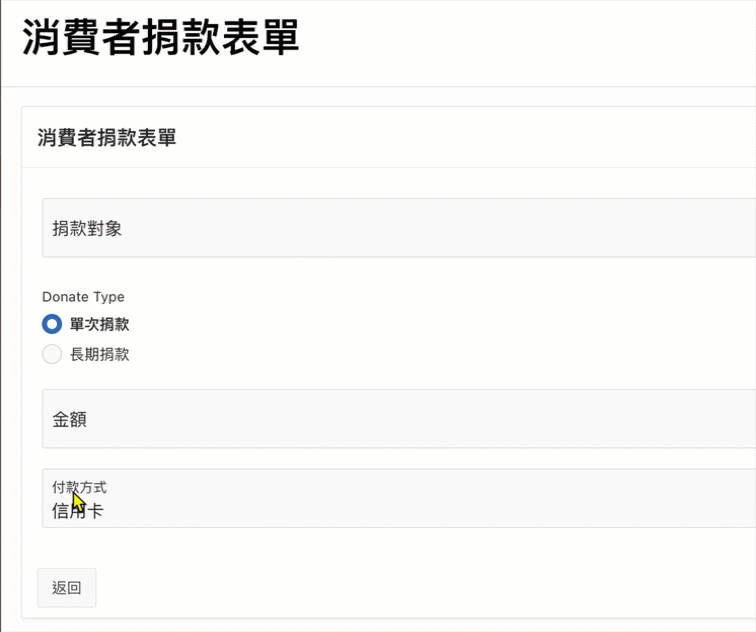
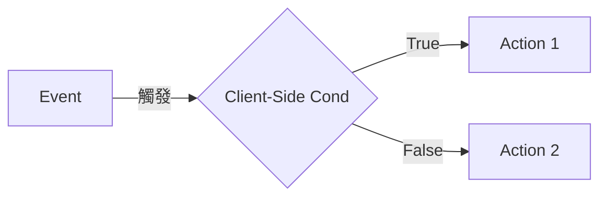
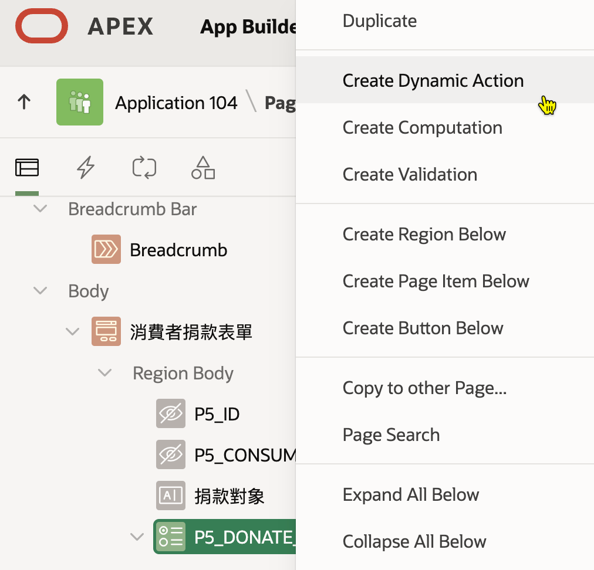
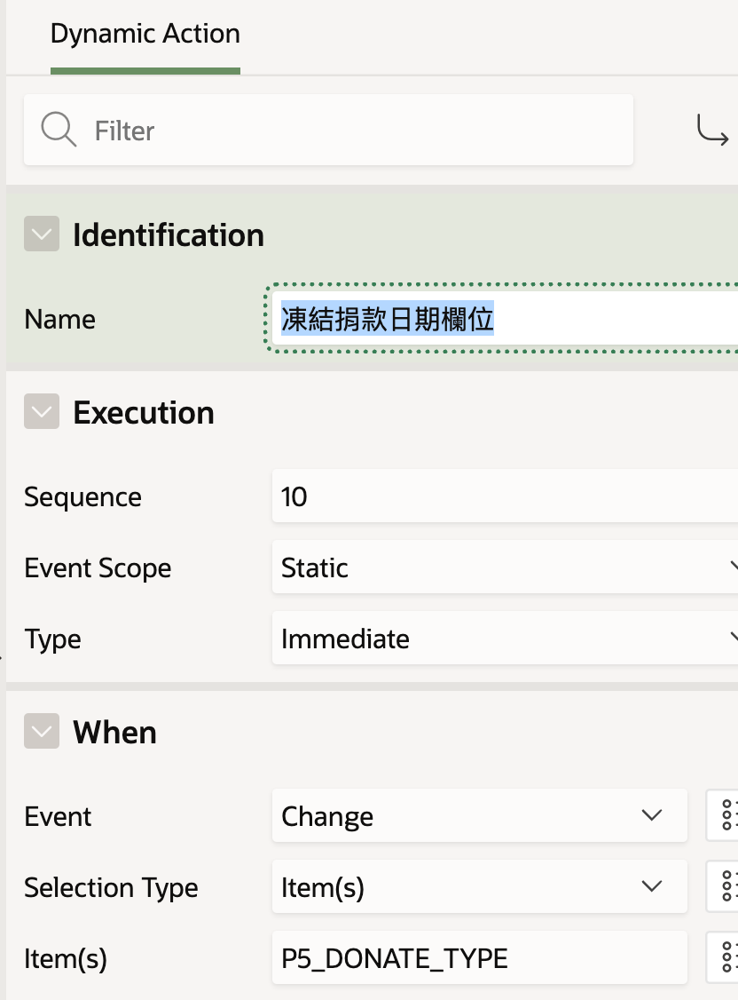
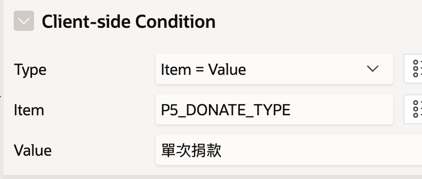
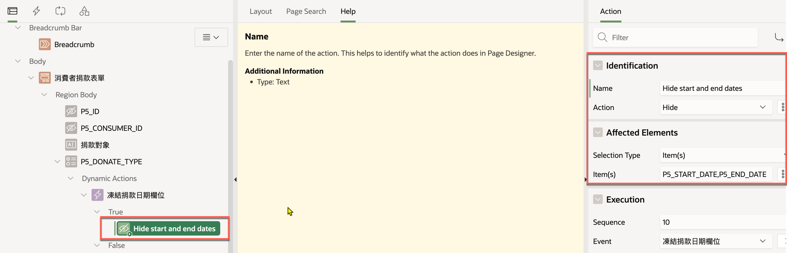
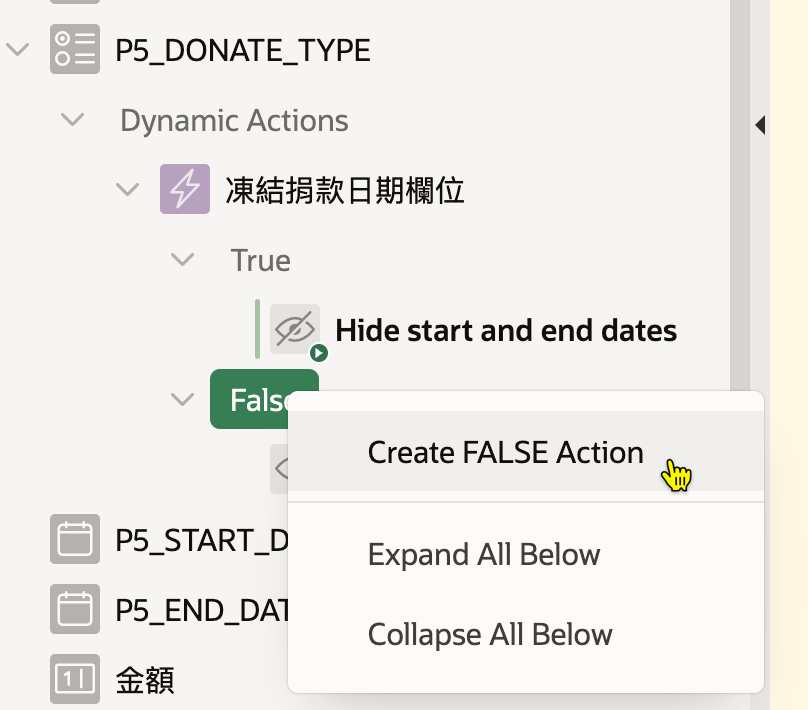
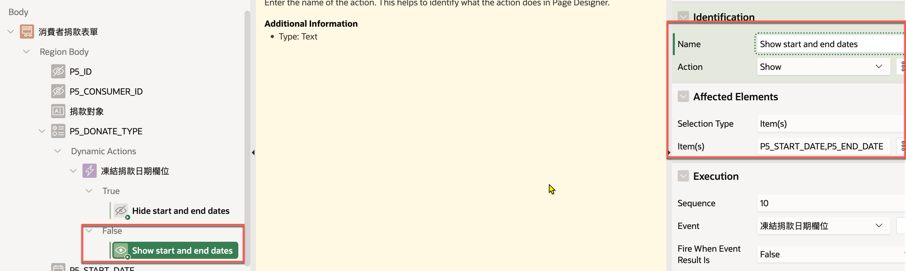

# 依選項值動態的顯示或隱藏欄位

## User Story

使用者在「消費者捐款表單」上，可選擇「單次捐款」或「長期捐款」的方式。

當使用者在表單上選擇「單次捐款」時，隱藏「捐款開始日期」及「捐款結束日期」欄位。 當使用者選擇「長期捐款」時，顯示前述兩個欄位。

## 技術原理

1. 在 browser (前端) 動態更新畫面，沒將資料送回 server (後端)。
2. 在前端，偵測選項值的變化，並根據選項值的變化，動態的顯示或隱藏欄位。
3. 在 Oracle Apex 中，使用 Dynamic Action 可以達成前述的需求。

Dynamic Action 的運作方式:

1. Event: 在某個 item 上加上一個 Dynamic Action, 監看 item 的值是否有變化，並設定事件觸發條件，例如 item 值改變。
2. Condition: 加入一個 client-side condition，檢查 item 的值是否符合某個條件, 以決定要執行哪個 action。
3. Action for True: 如果條件成立，要執行的 Action。
4. Action for False: 如果條件不成立，要執行的 Action。

Dynamic Action 中也有提供 Service-side condition, 可以用來控制該 Dynamic Action 是否有效。即，當條件滿足時，此 Dynamic Action 才可執行。

Dynamic Action 相關影片介紹：

## 實作步驟

假設 「消費者捐款表單」 已存在，且有一個選項值欄位 `P5_DONATION_TYPE`，可選擇「單次捐款」或「長期捐款」。

此外，在表單上，有兩個日期欄位 `P5_START_DATE` 及 `P5_END_DATE`，分別代表「捐款開始日期」及「捐款結束日期」。

### Steps

S1. 在 Page Designer 中，選擇「P1\_DONATION\_TYPE」欄位，右鍵選擇「Create Dynamic Action」。

S2. 設定 Dynamic Action 的名稱為 `凍結捐款日期欄位`

S3. 設定 WHEN 相關的屬性: - Event: Change (當選項值改變時) - Selection Type: Item(s) (要監看的欄位) - Item(s): P5\_DONATION\_TYPE (被監看的欄位名稱)

S4. 設定 Client-Side Condition 相關屬性: - Type: Item = Value (當欄位的值等於某個值時) - Item: P5\_DONATION\_TYPE (被檢查的欄位) - Value: 單次捐款 (當欄位的值等於「單次捐款」時)

S5. 設定 Client-Side 為 True 時要執行的 Action: - Name: Hide Start and End Date - Action: Hide - Selection Type: Item(s) - Item(s): P5\_START\_DATE, P5\_END\_DATE

S6. 在 False 的節點上， mouse right click, 選擇 Create False Action.

S7. 設定 Client-Side 為 False 時要執行的 Action: - Name: Show Start and End Date - Action: Show - Selection Type: Item(s) - Item(s): P5\_START\_DATE, P5\_END\_DATE

S8. 點選 Save 按鈕, 儲存頁面並測試。

**提醒**

1. 頁面的 Item 或 Region name 最好使用英文，以避免在程式碼中出現亂碼。
2. 其次，名稱前會加上 page number, 例如 `P5_DONATION_TYPE`, `P5` 代表 page number 5。
