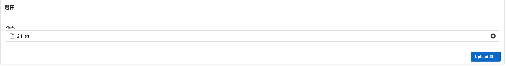

# 一次上傳多張圖片

## Use Case

假設已知小農編號(farmer_id). 

在新增或更新產品時, 可以一次選擇多張圖片並上傳。

在編輯產品時, 可以預覽圖片，並刪除不需要的圖片。


## UI 設計 

建立資料時，需要先建立產品，然後再上傳圖片，因為圖片需要關聯到產品。

Form 分成二個部分，一個是產品的基本資訊區域，其次圖片區域。在圖片區中再分成圖片的上傳子區域，及已上傳的產品圖片子S區域。


## 表格分析

產品與圖片的關係為一對多。

產品表格: `app_products`

圖片表格: `app_media`

```
Name           Null?    Type          
-------------- -------- ------------- 
ID          NOT NULL NUMBER              
PROD_ID              NUMBER              
FILENAME             VARCHAR2(4000 CHAR) 
MIME_TYPE            VARCHAR2(4000 CHAR) 
CHARSET              VARCHAR2(4000 CHAR) 
LAST_UPDATE          DATE                
CONTENT              BLOB         
```

## Apex 相關技術及原理

Apex 版本 23.1

### File Upload 元件

使用 `File Upload` 在本地選擇多個圖片，然後上傳。

設定 Storage 相關屬性:
- Type: `Table APEX_APPLICATION_TEMP_FILES`。將上傳的圖片存儲到 `apex_application_temp_files` 表格。
- Allow Multiple Files: `Yes`。用戶可以一次選擇多個圖片。


圖: `File Upload` 元件的 Storage 相關屬性

配合這樣的設定，當用戶選擇多個圖片後，這些圖片會被寫入 `apex_application_temp_files` 表格。
只有當 submit page 時，被 `File Upload` 元件選擇的圖片才會被寫入 `apex_application_temp_files` 表格。
未提交前，`apex_application_temp_files` 表格中不會有任何記錄。

Submit page 後, `File Upload` 元件內的值(client-side component) 會被清空, 但在 Session State 中會保留。
若此時再立刻執行 submit page 時, 會以 `File Upload` 元件內的值為主，而不使用 Session State 中的值，以避免重複上傳。

若後續要使用，要將 `File Upload` 元件的值存儲到其他 item 中。


### apex_application_temp_files 

`apex_application_temp_files` 是一個 view，用來存儲 `File Upload` 元件所選擇的文件。它的欄位包括 `filename`, `mime_type`, `id`, `application_id`, `name`, `created_on`, `blob_content`。

存到 `apex_application_temp_files` table 的檔案每次個會有一個 `id` 來識別, 這個 `id` 會在被寫入時自動產生
name 欄位的值為 <id>/<filename> 的組合。

`File Upload` 元件會儲存所選擇的多個檔案的 `<id>/<filename>` 的組合組，並以 `:` 分隔。

要找出 `apex_application_temp_files` table 中要上傳的檔案，可以使用以下 SQL:

```sql
select filename, mime_type, id, application_id, name, created_on
from apex_application_temp_files
where name in (select column_value from table(apex_string.split(:P2_PHOTO, ':')));
```

`apex_string.split` 是一個內建的 PL/SQL 函數，用來將字串按照指定的分隔符分割成多個子字串, 回傳的是一個 apex_t_varchar2 (table of varchar2) 的資料型態物件。 
`table()` 可直接將 `APEX_T_VARCHAR2` 轉資資料來源，在 from 子句中使用。

### 在表單中維護已上傳的圖片

使用 `Interactive Grid`(IG) 來維護已上傳的圖片。 
IG 提供用刪除表格資料的功能。
也可以在 IG 的欄位中顯示圖片。

### 在IG 的欄位中顯示圖片

在 IG 欄位中顯示圖片的方式之一是提供圖片的 URL [4]. 

做為是, 首先在 IG 中增加個空白欄位，其類型為 HTML Expression。
接著, 在 img 標籤的 src 屬性中，設定 RESTful Web Service 的 URL，用來取得圖片。

具體來說, 設定 HTML Expression 如下：
```html

```
在 src 屬性中，`project3/prod_img/fetch/`  RESTful Web Service 的 URL，用來取得圖片。
`&ID.` 及 `&FILENAME.` 是 IG 中的欄位名稱。

### 為 APP_MEDIA 表格建立 RESTful Web Service 提供圖片

建以 REST endpoint 來提供圖片. 

URL patten 為: `project3/prod_img/fetch/:ID`, 其中：
- `project3` 是 schema name
- `prod_img` 是 RESTful Web Service 的模組名稱
- `fetch/:ID` 是 URI pattern (或稱 Resource Template)，其中 `:ID` path parameter 用來指定圖片的 ID。

在 `fetch/:ID` 中對應的 GET method 的 handler 的設定如下:
- Source Type: `Media Resource`
- Source:
```sql
-- SQL 的 column 第一個為 http header 中的 content-type, 
--  第 2 個 column 為放在 response body 中回傳的檔案或圖片.
select 'image/*', content
from app_media
where id = :id
```

更多詳細設定，請參考[1, 2]

### 如何依據不同的 button action 執行不同的 Process

點擊 Button 時，其名稱為成為 `REQUEST` 的值，可以利用這個值來判斷要執行哪個 Process。

在 Process 的 Server-Side Condition 中，可以使用 `REQUEST` 來判斷是否執行某個 Button 的 Action。

例如, 以下的 Process 只有按下 CREATE 或 SAVE(Apply Changes) 按鈕時才會執行：


## 實作範例

### S1. 使用 Wizard 為 APP_PRODUCTS 表格建立 Form。

APP_PRODUCTS 表格的欄位:

```
Name               Null?    Type               
------------------ -------- ------------------ 
ID                 NOT NULL NUMBER             
FARMERS_ID                  NUMBER             
PR_NAME                     VARCHAR2(200 CHAR) 
THE_DESC                    CLOB               
UNIT                        VARCHAR2(200 CHAR) 
QUANTITY                    VARCHAR2(200 CHAR) 
PLANT_START_MONTH           DATE               
PLANT_END_MONTH             DATE               
ORIGIN                      VARCHAR2(100 CHAR) 
FAR_NAME                    VARCHAR2(200 CHAR) 
PHOTO                       BLOB               
ATTACH_MIMETYPE             VARCHAR2(255)      
ATTACH_FILENAME             VARCHAR2(255)      
ATTACH_LAST_UPDATE          DATE               
ATTACH_CHARSET              VARCHAR2(128)      
UNIT_PRICE                  NUMBER     
```

Wizard 會為 `PHOTO` 欄位建立 File Upload 元件, 並設定其 Source 相關屬性, 對應到 table 中的 `PHOTO` 欄位。

我們不使用此欄位, 因為上傳的多張圖片會先存在 `apex_application_temp_files` 表格中。

### S2. 建 Page Body 下建立個 "圖片" region.

我們要在這個區域中建立兩個子區域，一個是上傳圖片的區域，另一個是已上傳圖片的區域。


### S3. 在 "圖片" region 中建立個 "選擇" 子區域，並在子區域中建立個 File Upload 元件。


假設 File Upload 元件的名稱為 `P4_PHOTO`。

### S4. 設定 File Upload 元件的 Storage 及 Session State 相關屬性。

Storage 屬性:


Session State 屬性:


這個 page item 沒有對應到任何的 table column. 

### S5. 在 "選擇" 子區域中建立 `UPLOAD_IMG` 按鈕, 建立 Action 以上傳圖片。

按下 `UPLOAD_IMG` 按鈕時，會執行 process 將 `apex_application_temp_files` 中的圖片上傳到 `app_media` 表格中。
會使用 `P4_PHOTO` 內的值來決定要上傳哪些圖片。

建立的按鈕如下: 
- Identification
  - Button Name: `UPLOAD_IMG`. 這成為 `REQUEST` 的值。
  - Label: `Upload 圖片`
- Behavior
  - Action: `Submit Page`


  
接著，建立一個 Process 來處理上傳圖片的動作。

- Identification
  - Name: `Insert uploaded images from temp files`
- Source
    - Language: `PL/SQL Code`
    - PL/SQL Code:
```sql
declare
  -- Get the item values and assign them to local variables
  l_source_item varchar2(2000) := :P4_PHOTO;
  l_product_id number := :P4_ID;
  -- Cursor to iterate through the uploaded images in apex_application_temp_files
  cursor image_cur(file_upload_item varchar2) is 
     select filename, mime_type, created_on, blob_content 
     from apex_application_temp_files
     where name in (
        select column_value from table(apex_string.split(file_upload_item, ':'))
     );
begin
    -- Use the cursor for-loop to iterate through the uploaded images and 
    -- insert them into the app_media table
    for img in image_cur(l_source_item) loop
      -- insert into app_media table
        insert into app_media (prod_id, filename, mime_type, LAST_UPDATE, content)
        values (l_product_id, img.filename, img.mime_type, current_date, img.blob_content);
    end loop;

    -- or use the insert with subquery to complete the task:
    -- insert into app_media (prod_id, filename, mime_type, LAST_UPDATE, content)
    -- select l_product_id, filename, mime_type, current_date, blob_content
    -- from apex_application_temp_files
    -- where name in (select column_value from table(apex_string.split(l_source_item, ':')));
end;
```

再設定此 Process 的 Server-Side Condition，只有當按下 `UPLOAD_IMG` 按鈕時且 `:P4_PHOTO` 不為空時才執行。


將 `apex_application_temp_files` 中的圖片上傳到 `app_media` 表格中後，要刪除 `apex_application_temp_files` 中的記錄。

建立一個 Process 來刪除 `apex_application_temp_files` 中的記錄。

- Identification
  - Name: `Clear apex_application_temp_files`
- Source
  - Language: `PL/SQL Code`
  - PL/SQL Code:

```sql
begin
  delete from apex_application_temp_files;
end;
```

再設定 process 的 client-side condition，只有當按下 `UPLOAD_IMG` 按鈕時且 `:P4_PHOTO` 不為空時才執行。


所以，當按下 `UPLOAD_IMG` 按鈕時，會執行兩個 Process，一個是將 `apex_application_temp_files` 中的圖片上傳到 `app_media` 表格中，另一個是刪除 `apex_application_temp_files` 中的記錄。

注意，這兩個 Processes 必須在 `Process form 建立產品` 之後執行，因為要先建立產品，再上傳圖片。


更細緻的控制 `Upload 圖片` 按鈕的顯示, 只有當 `:P4_ID` 不為空時, 表示己經建立了產品，才顯示此按鈕。

### S6. 在 "圖片" region 中建立個 "已上傳圖片" 子區域，並在子區域中建立個 Interactive Grid。


IG 的 SQL Query:

```sql
select id, prod_id, filename, mime_type, last_update,
 '' img  
from app_media
where prod_id = :P4_ID;  -- :P4_ID 是 產品表單中的產品 ID 欄位(Primary Key)
```

最後一個欄位 `img` 是一個 HTML Expression 欄位，用來顯示圖片。

### S7. 在 IG 中的 `img` 欄位中設定 HTML Expression:

```html

```


假設在 `project3` schema 中建立了一個 RESTful Web Service 模組 `prod_img`，並在其中建立了一個 RESTful Web Service `fetch/:ID` 用來提供圖片。


### S8. 設定 IG 的 Primary Key column 

接著, 設定 IG 的 PK column, 以便 Process 可以刪除 IG 中的資料。
選擇 ID 欄位, 啟用 Source > Primary Key 屬性:


如果 IG 中沒有 PK column, 執行時會報錯。

處理 IG DML 操作的 Process 由 Apex 自動加入。Process type 為 `Interactive Grid - Automatic Row Processing (DML)`。


### S9. 測試

為要了測試此表單, 在 Before Header 加一個 Process, 自動設定 `:P4_ID := 1` 及 `:P4_FARMERS_ID := 5` 的值。


執行此頁面。Apex 會自動載入 farmer_id = 1 及 product_id = 5 的產品資料。

點選 `File Upload` 元件，選擇多個圖片: 


`File Upload` 元件會顯示選擇的圖片個數。右側的 x 按鈕可以刪除選擇的圖片。
此時，圖片還沒有上傳到 `apex_application_temp_files` 表格中。



點選 `Upload 圖片` 按鈕，上傳圖片。
此 Action 會執行兩個 process: `Insert uploaded images from temp files` 及 `Clear apex_application_temp_files`。
他們在步驟 S5 中建立。

若順利, 圖片會出現在 IG 中。


要刪除圖片, 可以在 IG 勾選要刪除的圖片，然後點選 IG 中的列選單中的 `Delete Rows` 選單項目。


完成後，按下 `Save` 按鈕, 會更新在 IG 上所做的變更。
此動會會執行 IG 的 DML Process: `Interactive Grid - Automatic Row Processing (DML)`。

### 註記

若要調整 IG 中的圖片大小，可以在 IG 中的 `img` 欄位的 HTML Expression 中設定 `style` 屬性或加入 CSS class。
在上面的例子中，我們設定了 `class="app_photo"`。

所以在 form 表單的 page 中，可以加入 inline CSS:

```css
.app_photo {
    width: 40%;
}
```


## 結論


本文件說明了如何在 Oracle APEX 中實現一次上傳多張圖片的功能。

在這個例子中，我們使用了 `File Upload` 元件選擇多張圖片，並暫存到 `apex_application_temp_files` 表格中。

撰寫 process 來將 `apex_application_temp_files` 中的圖片新增到 `app_media` 表格中。

最後，我們使用 Interactive Grid 來顯示已上傳的圖片，並提供刪除圖片的功能。


## 參考資料

1. [Working with RESTful Services, BLOBs, and Media Types](https://www.thatjeffsmith.com/archive/2017/01/working-with-restful-services-blobs-and-media-types/)
2. [ORDS and Source Types](https://www.thatjeffsmith.com/archive/2019/02/ords-and-source-types/)
3. [Oracle ORDS Developer's Guide, 24.1](https://docs.oracle.com/en/database/oracle/oracle-rest-data-services/24.2/orddg/implicit-parameters.html#GUID-B0BB1694-715C-4948-84A5-307EA3868063)
4. [8.13 Understanding BLOB Support in Forms and Reports, App Builder User's Guide](https://docs.oracle.com/en/database/oracle/apex/23.1/htmdb/understanding-blob-support-in-forms-and-reports.html)
5. [4.2 Global Variables, API Reference](https://docs.oracle.com/en/database/oracle/apex/23.2/aeapi/APEX_APPLICATION-Global-Variables.html)
