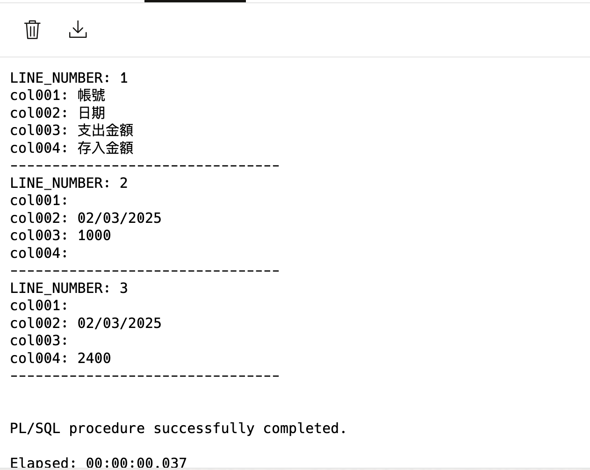

# 剖析 CSV 檔案

## 簡介

有一個 CSV 檔案，內容如下：

```csv
帳號,日期,支出金額,存入金額,備註
,02/03/2025,1000,,ATM/自行交易
,02/03/2025,,2400,票交媒體行政院發
```

要取得每列的欄位資料並產生 insert 語法, 將資料寫入資料表中。

Oracle Apex 的 APEX\_DATA\_PARSER 套件的 `parse` 方法可以將 CSV 檔案的內容轉換成資料表的格式。

之後可以使用 `insert` 語法將資料寫入資料表中。

## 使用 APEX\_DATA\_PARSER 套件

APEX\_DATA\_PARSER.PARSE 函數回傳 `apex_t_parser_table pipelined` 的資料型態，這是一個 pipelined table function, 可以放入 TABLE() 中，轉成 FROM 子句的資料來源。

`parse()` 的必要參數有:

* p\_content\_type:BLOB 物件的內容類型
* p\_file\_name, p\_file\_type, p\_file\_profile 三者其中之一

p\_file\_name 用來推斷檔案的類型, 可用 p\_file\_type 明確指定檔案類型。

我們使用 CURSOR FOR LOOP 來讀取資料，並印出每一列的資料。

```sql
DECLARE
 l_clob    CLOB := q'[
帳號,日期,支出金額,存入金額,備註
,02/03/2025,1000,,ATM/自行交易
,02/03/2025,,2400,票交媒體行政院發
]';

-- 將 CLOB 轉成 BLOB
l_blob    BLOB := UTL_I18N.STRING_TO_RAW(l_clob, 'AL32UTF8');

-- 定義一個 CURSOR 
cursor txn_cursor is
    select line_number, col001, col002, col003, col004
    from table(APEX_DATA_PARSER.parse(
        p_content => l_blob,
        p_file_name => 'test.csv'));

BEGIN

-- Use the cursor to iterate through the rows
    FOR r_row IN txn_cursor
         loop
            dbms_output.put_line('LINE_NUMBER: ' || r_row.line_number);
            dbms_output.put_line('col001: ' || r_row.col001);
            dbms_output.put_line('col002: ' || r_row.col002);
            dbms_output.put_line('col003: ' || r_row.col003);
            dbms_output.put_line('col004: ' || r_row.col004);
            dbms_output.put_line('--------------------------------');
            
    end loop;
end;
```

執行結果



## 產生 INSERT 語法

修改 loop 中的程式碼，將每一列的資料轉成 INSERT 語法:

```sql
...

FOR r_row IN txn_cursor
         loop
            insert into test_table(col001, col002, col003, col004)
            values
            (
                r_row.col001,
                r_row.col002,
                r_row.col003,
                r_row.col004
            )
end loop;
-- loop 後 commit;
commit;

...
```

## 在 Oracle Apex 中使用

在 Oracle Apex 頁面中我們會使用 FILE\_UPLOAD 元件來上傳 CSV 檔案.\
FILE\_UPLOAD 元件的儲存類型預設為 APEX\_APPLICATION\_TEMP\_FILES, 我們需要從 APEX\_APPLICATION\_TEMP\_FILES 中取得上傳的檔案。

```sql
-- 取得上傳檔案內容
SELECT blob_content INTO l_blob
FROM apex_application_temp_files
WHERE name = :P9_CSV_UPLOAD; -- 請用你實際的 File Browse 元件名稱
```

之後，就可依照上面的程式碼來處理 CSV 檔案了。

## 提醒

匯入前，先檢查 CSV 檔案的內容，確保資料正確無誤。

## 參考資料

* [22.10 PARSE Function](https://docs.oracle.com/en/database/oracle/apex/24.1/aeapi/APEX_DATA_PARSER.PARSE-Function.html#GUID-B815CF74-C469-4F78-9433-643D1339E930)
* [Super-Easy CSV, XLSX, JSON or XML parsing: About the APEX\_DATA\_PARSER package](https://blogs.oracle.com/apex/post/super-easy-csv-xlsx-json-or-xml-parsing-about-the-apex-data-parser-package)
