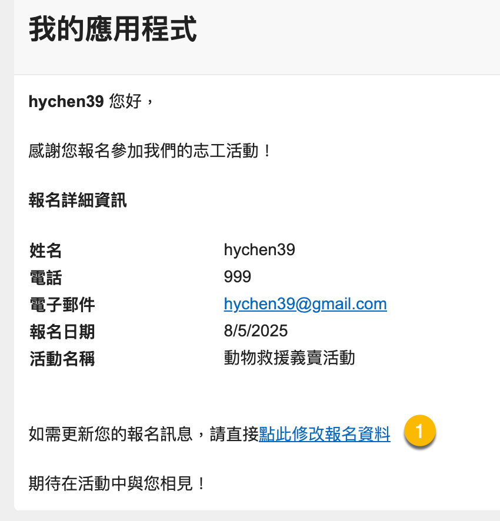
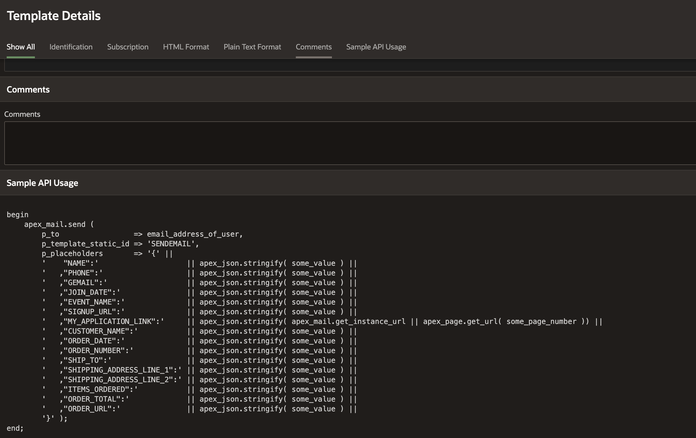
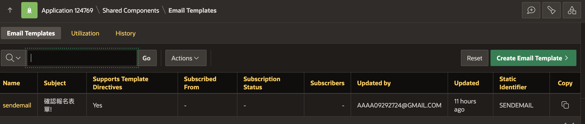
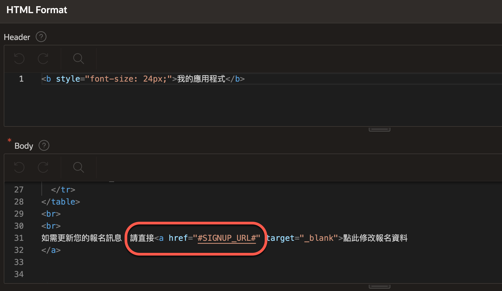
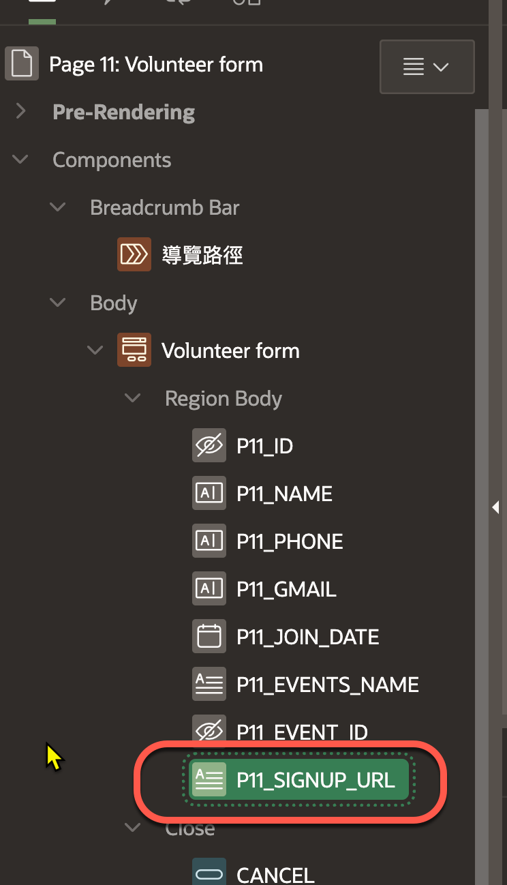
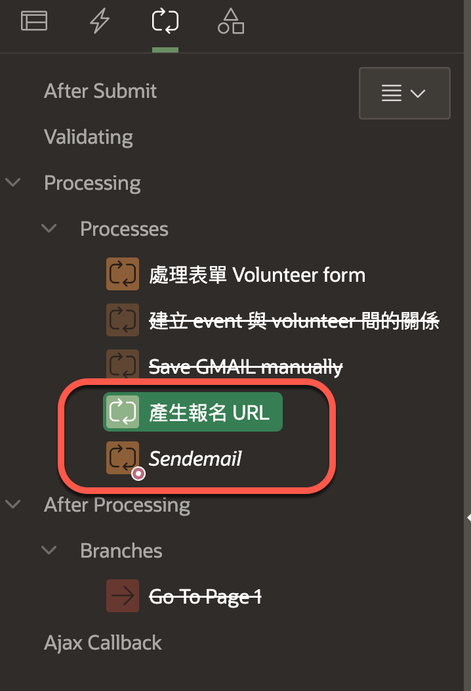
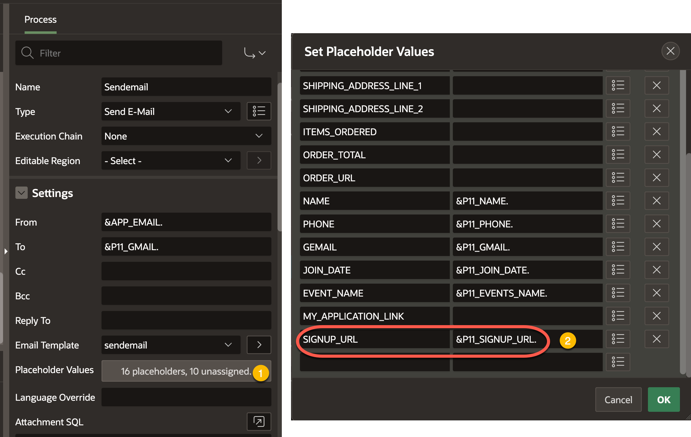

# 在 email 中提供 page url

## Use Case 

在 email 的內容中提供 page url, 讓使用者能夠回去頁面編輯資料。

例如: 在活動報名成功的 email 中，提供 "點此修改報名" 的連結，讓使用者能夠回到報名頁面修改報名資料。



## 原理

<!-- Email Template (郵件樣版)
樣版中的佔位字元(replace-holder)
表單欄位(page item)與佔位字元的對應
使用 `Send E-Mail` process 撘配 Email Template 發送 email。 -->

在 Oracle APEX 是透過 Email Template（郵件樣版）搭配 Send E-Mail Process 以發送郵件。

Email Template 可事先定義好郵件的標題與內容，並在內容中使用佔位字元（placeholder），例如 #FULL_NAME# 或 #REQUEST_ID#，作為日後替換的變數。

使用者需在 Send E-Mail Process 中指定 Email Template，並提供對應的頁面項目值。當發送郵件時，Send E-Mail Process 會自動將頁面項目的值（如 :P1_NAME, :P1_EMAIL 等）替換到 Email Template 中的佔位字元，產生最終的郵件內容。

Oracle Apex 提供 API 以程式化的方式配合 Email Template 產生內容及發件郵件。`APEX_MAIL.SEND` 可以指定收件人、主旨、內容等，並發送郵件。

若要在 `APEX_MAIL.SEND` 中使用 Email Template，需要使用以下型式的函數簽名:

```sql
APEX_MAIL.SEND (
    p_template_static_id IN VARCHAR2,    
    p_placeholders       IN CLOB,
    p_to                 IN VARCHAR2,
    p_cc                 IN VARCHAR2 DEFAULT NULL,
    p_bcc                IN VARCHAR2 DEFAULT NULL,
    p_from               IN VARCHAR2 DEFAULT NULL,
    p_replyto            IN VARCHAR2 DEFAULT NULL,
    p_application_id     IN NUMBER   DEFAULT apex_application.g_flow_id );
```

其中重要的樣版相關的參數:
- `p_template_static_id`: 指定 Email Template 的靜態 ID。在 Apex Shared Components 中建立 Email Template 時所設定的靜態 ID。
- `p_placeholders`: 一個 JSON 格式的 CLOB 字串，包含所有佔位字元及其對應的值。這些值會在發送郵件時被替換到 Email Template 中。

要產生 JSON 格式的 `p_placeholders`，可以使用 `json_object` 函數來建立一個 JSON 物件字串。例如:

```sql
apex_mail.send(
  p_to                 => 'user@example.com',
  p_template_static_id => 'ORDER_CONFIRMATION',
  p_placeholders       => json_object(
                            'NAME' VALUE :P1_NAME,
                            'ORDER_ID' VALUE :P1_ORDER_ID
                          )
);
```
這樣就可以在 Email Template 中使用 #NAME# 和 #ORDER_ID# 佔位字元，並在發送郵件時自動替換為對應的頁面項目值。

你可以在 Oracle Apex 的 Email Template 定義頁面處找到程式碼的 Sample:



相關資料：
- [37.11 SEND Procedure Signature 2, API Reference, R23.2](https://docs.oracle.com/en/database/oracle/apex/23.2/aeapi/SEND-Procedure-Signature-2.html)
- [APEX_MAIL : Send Emails from PL/SQL](https://oracle-base.com/articles/misc/apex_mail-send-emails-from-plsql)

## 步驟

### S1. 建立 Email Template

路徑: App Home > Shared Components > Email Templates



### S2. 在 Email Template 新增 `#SIGNUP_URL#` 佔位字元

編輯 Email Template, 在內容中新增 `#SIGNUP_URL#` 佔位字元。



### S3. 在頁面中建立 `Px_SIGNUP_URL` 頁面項目

在頁面中建立 `Px_SIGNUP_URL` 頁面項目，這個項目將用來存放產生的報名頁面 URL。



### S4. 新增程序以產生表單頁面的 URL 並存入 `Px_SIGNUP_URL` 頁面項目

- Process type: Execute Code 
- PL/SQL Code:

```sql
declare 
  l_url varchar2(5000);
  l_host varchar2(200) := 'https://apex.oracle.com';
begin
  l_url := apex_page.get_url(
    p_page => 11,
    p_items => 'P11_ID',
    p_values => :P11_ID
);
:P11_SIGNUP_URL := l_host || l_url;
end;
```

假設 `P11_ID` 是報名頁面的主鍵項目，並且報名頁面的編號是 11；`P11_SIGNUP_URL` 是我們在 S3 步驟中建立的頁面項目。

這個程序必須在 Send E-Mail Process 執行之前執行，以確保 `Px_SIGNUP_URL` 頁面項目已經包含了正確的 URL。




### S5. 在 Send E-Mail Process 中設定 `#SIGNUP_URL#` 佔位字元與 `Px_SIGNUP_URL` 頁面項目的對應



## 總結

在 Oracle APEX 中，可以透過 Email Template 搭配 Send E-Mail Process 來發送包含頁面 URL 的郵件。

透過 `apex_page.get_url` 函數可以自動產生指向特定頁面的 URL，並將其存入頁面項目中。

最終在發送郵件時，使用 Email Template 中的佔位字元來替換為實際的 URL，讓使用者能夠方便地回到頁面進行資料修改或查看。

重要的元件有:
- Email Template: 定義郵件內容與佔位字元。
- Send E-Mail Process: 負責發送郵件並替換佔位字元。
- `apex_page.get_url`: 用於產生指向特定頁面的 URL。

