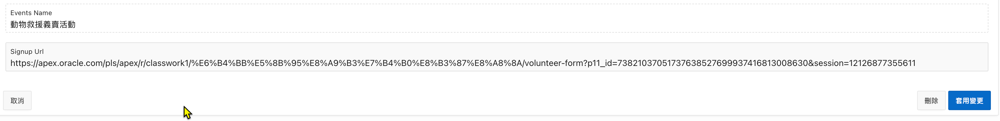

# 使用程式產生 page url

## Use Case 

想要產生一個指向特定頁面的 URL，並且在 URL 中包含特定的頁面項目值。

例如: 在報名成功的 email 中，提供一個指向報名頁面的 URL, URL 中帶報名的 ID。當使用者點擊此 URL 時，可以直接跳轉到報名頁面，並且自動填入報名的 ID。

## 原理

Oracle APEX 提供了 `apex_page.get_url` 函數，可以用來產生指向特定頁面的 URL。此函數可以接受頁面編號、頁面項目及其值等參數。

完整的 `apex_page.get_url` 函數說明參考 [43.4 GET_URL Function, API Reference, Oracle Apex R24.1](https://docs.oracle.com/en/database/oracle/apex/24.1/aeapi/GET_URL-Function.html)

## 範例

應用程式的報名頁面編號為 11，報名的主鍵放在 `P11_ID` 頁面項目中。

使用以下 PL/SQL 程式碼來產生指向報名頁面的 URL，並將其存入 `P11_SIGNUP_URL` 頁面項目中。

```plsql
declare 
  l_url varchar2(5000);
  l_host varchar2(200) := 'https://apex.oracle.com';
begin
  l_url := apex_page.get_url(
    p_page => 11,
    p_items => 'P11_ID',
    p_values => :P11_ID
);
  :P11_SIGNUP_URL := l_host || l_url;
end;
```

在 `apex_page.get_url` 函數中，`p_page` 參數指定了目標頁面的編號，`p_items` 參數指定了要包含在 URL 中的頁面項目，`p_values` 參數則是這些項目的值。

雖然我們沒有指定 `p_application` 及 `p_session` 參數，此函數會自動使用當前應用程式 ID (`:APP_ID`) 和當前會話 ID (`:APP_SESSION`)做為預設值。

因此, 此函數產生的 URL 相當於以下的 [friendly URL](https://docs.oracle.com/en/database/oracle/apex/22.2/htmdb/understanding-friendly-url-syntax.html#GUID-FEADECFC-612D-406B-ADE5-67CAFE3F8033):

```
/pls/r/<workspace_id>/<app_name>/<page_name>?P11_ID=<value>&session=<session_id>
```

`apex_page.get_url` 函數的 URL 並沒有包含 hostname, 所以程式中手動串接 hostname (`l_host`) 至 `l_url` 變數中, 產生完成的 URL. 

此 PL/SQL 產生的 URL 如下:




