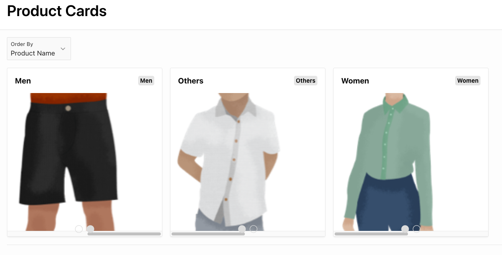
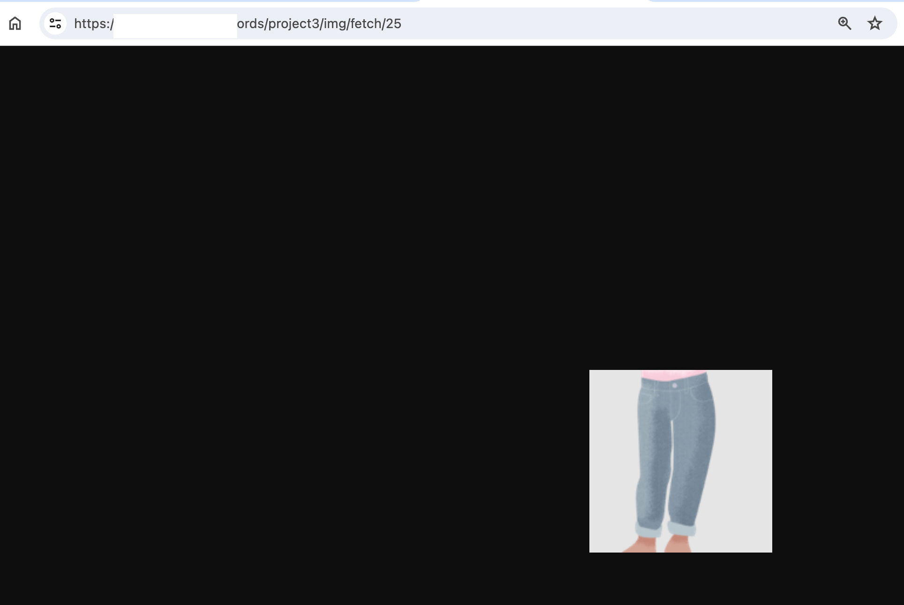

# 在 Card Region 顯示多張圖片

## Introduction

我們想要在 Card Region 中以 Carousel 的方式顯示多張圖片。

Moreaux \[1] 提供了一個逐步指南，在 Oracle APEX card region 中添加圖片輪播。

但是，該指南使網路上的圖片的 URL。在這文件中，我們將使用表格中的 blob 欄位，而非網路上的其它圖片。

## 程序

### S1. 為 Products 表格建立一個表單(Form)

**附註: 如果使用 RESTful Web Service 提供圖片下載，則不需要這個步驟。**

我們需要為 Products 表格建立一個表單(Form)，以取得使用 `APEX_UTIL.GET_BLOB_FILE_SRC` 時需要旳 `Display Image` item。

使用 Page Wizard 為 Products 表格建立一個表單。

將 `Product_Image` blob 欄位對應的 Form Item 的型態設定為 `Display Image`。


之後設定該 Item 的 Settings 相關屬性:

* Filename Column
* MIMI Type Column
* BLOB Last Updated Column

填入表格上對應到上述屬性的欄位名稱。


之後，我們會在 `APEX_UTIL.GET_BLOB_FILE_SRC` 中使用到這個 Item 的名稱(`P3_PRODUCT_IMAGE`)。

### S2. 設定 Card Region 中的 SQL Query 做為資料來源

新增一 page, 並加入一個 Card Region。

設定此 Card Region 的 Source 相關屬性:


```sql
-- first subquery to get the image urls from the blob column
with image_blob_src as (
    select product_id, 
       APEX_UTIL.GET_BLOB_FILE_SRC(p_item_name => 'P3_PRODUCT_IMAGE',
       p_v1 => product_id) img_src
    from products),
-- second subquery to get the product name, category and image urls
    product_image_urls as (
    select PRODUCT_ID,
       pc.PRODUCT_NAME,
       pc.CATEGORY,
       ibs.img_src image_url
    from PRODUCT_WITH_CATEGORY pc join image_blob_src ibs using (product_id))
-- main query to get the category and list of image urls
-- Assume that each category has multiple images
select pu.category, 
       listagg(pu.image_url, '|') within group (order by pu.product_id) url_list
from product_image_urls pu
group by pu.category;
```

在上述的 SQL Query 中：

* 我們使用了 `APEX_UTIL.GET_BLOB_FILE_SRC` 來取得圖片的 URL。
* 因為一個 Card 中可能會有多張圖片，所以在 main query 中，我們使用 `listagg` 函數來將每個 category 的圖片 URL 串接成一個字串，並以 `|` 分隔。後續在 HTML Expression 中，我們會使用這個字串欄位來建立多個圖片 的URL，以便在輪播中顯示。參考 \[2] 用到的技巧。

### S3. 設定 Card Region 中的 Media 的 HTML 內容 及 Media 要套用的 CSS Class

選擇 Card Region > Attributes Media

啟用 Advanced Formatting 選項。


在 Media 中，設定 CSS Class 為 `carousel_media`。


在 HTML Expression 中，設定如下的 HTML 內容：

```html
<div class="carousel_container">
   {loop "|" URL_LIST/}
      <div class="carousel_snap" >
         </img>
      </div>
   {endloop/}
</div>
<div class="carousel_dots">
    {loop "|" URL_LIST/}
          <span class="fa fa-circle carousel_dot" data-num="&APEX$I."></span>
    {endloop/}
</div>
```

第一個 div 中的 `URL_LIST` 是資料來源中的欄位。該欄位存放多個圖片的 URL , 並以 `|` 分隔。

`{loop/}{endloop/}` 為 Apex 23.1 的 Template Directive。在此，我們使用它來迭代 `URL_LIST` 中的每個 URL。

迭代過程中，`&APEX$ITEM.` 為當前迭代的 URL。`&APEX$I.` 為當前迭代的索引。

第二個 div 中的 `carousel_dots` 是用來顯示輪播指示器的。 `data-num` 屬性用來標識圖片的索引

### S4. 設定 Card Region 中的 CSS Class

在 Page > CSS > Inline 中新增以下 CSS 內容\[1]：

```css
.card-title {
    font-weight: bolder;
}

.card-subtitle {
    font-weight: lighter;
    font-size: smaller;
}

.carousel_media {
    flex-direction: column;
    padding: 0px;
    height: 300px;
}

.carousel_container {
    display: flex;
    overflow-x: scroll;
    scroll-behavior: smooth;
    scroll-snap-type: x mandatory;
    height: 300px;
    column-gap: 1rem;
    width: 100%;
}

.carousel_snap {
    scroll-snap-align: center;
    display: flex;
    flex-basis: 100%;
    flex-shrink: 0;
}

.carousel_image {
    width: 80%;
    object-fit: cover;
}


.carousel_dots {
    display: flex;
    position: absolute;
    bottom: .5rem;
    gap: 0.5rem;
    color: gainsboro;
}

```

### 原理說明: 捲動時同步輪播的指示器(Synchronizing the Carousel Indicators while Scrolling)

技術要求，當某個卡片進入畫面時，對應的輪播指示器要改變 icon class。

使用 Intersection Observer API，可以監聽元素進入畫面的事件。範例參考 \[2]。

我們會建立一個觀察者(Observer), 並告訴它要監聽哪個元素.

當被監聽的元素與觀察者所設定的根節點(root element)有交集時(intersection)，觀察者會執行 callback function。

建立觀察者時，要傳入一個 callback function，及一個 options 物件。

Options 物件可以設定以下屬性：

* root: 觀察者的根節點。如果沒有設定，則預設為 viewport。
* rootMargin: 根節點的邊界。可以設定為一個字串，例如 "10px 10px 10px 10px"，或是一個物件，例如 {top: 10, right: 10, bottom: 10, left: 10}。使用此屬性擴展或縮小 root 元素的 box 的範圍，以便提早或延遲觸發 intersection event。
* threshold: 一個介於 0 到 1 之間的數字，表示觸發的交集比例。例如 0.5 表示監聽元素已顯示一半時，觸發 callback function。可用陣列表示多個觸發點，例如 \[0, 0.25, 0.5, 0.75, 1]。

在 callback function 中，可以取得進入畫面的一或多個被監聽的元素(entries)，及觀察者(Observer)本身。 在 callback function 中，對每個 entry 做處理，例如改變元素的樣式，如下程式碼所示：

```js
let callback = (entries, observer) => {
  entries.forEach((entry) => {
    // Each entry describes an intersection change for one observed
    // target element:
    //   entry.boundingClientRect
    //   entry.intersectionRatio
    //   entry.intersectionRect
    //   entry.isIntersecting
    //   entry.rootBounds
    //   entry.target
    //   entry.time
  });
};
```

總結來說，Intersection Observer API 的使用程序如下：

1. 建立觀察者的選項及 callback function。

```js
let options = {
  root: document.querySelector("#scrollArea"), // 監聽的根節點. set null to use viewport
  rootMargin: '0px',
  threshold: 0.5
};
```

```js
let callback = (entries, observer) => {
  entries.forEach((entry) => {
    // Each entry describes an intersection change for one observed
    // target element:
    //   entry.boundingClientRect
    //   entry.intersectionRatio
    //   entry.intersectionRect
    //   entry.isIntersecting
    //   entry.rootBounds
    //   entry.target
    //   entry.time
  });
};
```

2. 建立觀察者物件

```js
let observer = new IntersectionObserver(callback, options);
```

3. 將被監聽的元素加入觀察者。

```js
let target = document.querySelector('#target');
observer.observe(target);
```

### S5. 在 Card Region 中使用 Intersection Observer API 更新 Carousel Indicators

參考 \[1] 的步驟。

#### S5.1 增加 Dynamic Action 以建立 Intersection Observer

在 Cards Region 中新增一個 Dynamic Action(DA), 當事件為 Page Change\[Cards] 時，執行 JavaScript Code，以建立 Intersection Observer。

DA 的 `WHEN` 相關屬性如下：


接著，增加一個 True Action, 類型為 Execute JavaScript Code.


JavaScript 內容如下：

```js
// Loop through all the carousel containers
// 找出所有的輪播容器 (class 為 carousel_container 的 div)
document.querySelectorAll(".carousel_container").forEach(
    function(container){
    // container 為選到的輪播容器
    //Declare the IntersectionObserver options
    let options = {
      root: container,   
      rootMargin: "0px", 
      threshold: [0.5, 1]     
    };

    // Create the observer
    // intersectionCallback 另外定義
    let observer = new IntersectionObserver(intersectionCallback, options);

    //Get all the images inside the container
    let images = container.querySelectorAll("img");

    // Loop through all images and start observe it
    // 設定所要觀察的圖片
    images.forEach(function(image){
        observer.observe(image);
    });

});
```

接著再設定此 Action 的 Execution 相關屬性, 啟用 Fire on Initialization. 如此，當頁面載入時，就會執行此 Action。


#### S5.2. 定義 Intersection Observer 的 callback function

在 Page 的 Function and Global Variable Declaration 中新增一個 JavaScript Function，做為 Intersection Observer 的 callback function。


在 Card 中的 Media 的 html 元素結構如下：

```html
<div class="carousel_container">
   {loop "|" URL_LIST/}
      <div class="carousel_snap" >
         </img>
      </div>

   {endloop/}
</div>
<div class="carousel_dots">
    {loop "|" URL_LIST/}
          <span class="fa fa-circle carousel_dot" data-num="&APEX$I."></span>
    {endloop/}
</div>
```

配合上述的 html 元素結構，新增的 Intersection Observer 的 callback function 如下：

```js
function intersectionCallback(entries) {
    // Private function used to update the dots
    function updateDots(container, num){
        // container  為輪播容器, class 為 carousel_container 的 div
        // num 為圖片的編號，放在 data-num 屬性中

        // Get all the individual spans of the class carousel_dot
        let dots = container.nextElementSibling.querySelectorAll(".carousel_dot");
        //Loop through the dots
        dots.forEach(function(dot){
            // extract the data-num attribute
            let dotNum = dot.getAttribute("data-num");
            //Add or remove the dot's classes depending on whether it's the selected image or not
            if (dotNum === num ) {
                dot.classList.remove("fa-circle-o");
                dot.classList.add("fa-circle");
            } else {
                dot.classList.add("fa-circle-o");
                dot.classList.remove("fa-circle");
            }
        });
    }

    // This loops through the entries providing in the callback
    entries.forEach((entry) => {
        //If the image is 100% visible
        if (entry.isIntersecting === true && entry.intersectionRatio === 1) {
            // Get the image, image num and parent to update the dots
            let image = entry.target;
            let parent = image.closest(".carousel_container");
            let imageNum = image.getAttribute("data-num");
            updateDots(parent, imageNum);
        }  
    });
}
```

### 結果



## 使用 RESTful Web Service 取得圖片 url

使用 RESTful Web Service 提供圖片下載。

因為，使用 `APEX_UTIL.GET_BLOB_FILE_SRC` 來取得圖片的 URL 會相依於某個 `Display Image` item。

我們會在 `img` 標籤的 `src` 屬性中，改使用 RESTful Web Service 的 URL。

### S1. Enable the REST service in the PROJECT3 schema \[5].

在 Schema 中啟用 RESTful Web Service。

啟用時，沒有使用自動授權，以利測試。

```sql
DECLARE
  PRAGMA AUTONOMOUS_TRANSACTION;
BEGIN

    ORDS.ENABLE_SCHEMA(p_enabled => TRUE,
                       p_schema => 'PROJECT3',
                       p_url_mapping_type => 'BASE_PATH',
                       p_url_mapping_pattern => 'project3',
                       p_auto_rest_auth => FALSE);

    commit;
END;
```

### S2. Create a RESTful Web Service Module in the Apex.

Path: SQL Workshop > RESTful Services 建立新的 RESTful Web Service Module。

Click Modules > (B)\[Create Module]


Enter:

* Module Name: `img`
* Base Path: `/img/`

之後在 Full URL Path 中會顯示此 module 的完整 URL。


完成 Module 的建立後，我們要建立在此 Module 下的 Resource 的 URI Template。

### S3. Create a Resource Template in the RESTful Web Service Module.

點選在 Module 下方的 (B)\[Create Templates]。


輸入 URI Template: `fetch/:id`

其中 `:id` 是一個路徑參數，表示要取得的圖片的 id，他是一個 bind variable, 可直接在 SQL 或 PL/SQL 中使用。


完成 Resource URI Template 的建立後，我們要設定此 Resource 的 Handler, 用以處理在此 URI 下的不同的 HTTP Method 的請人求。

### S4. Create a Handler for the Resource URI Template.

點選在 Resource URI Template 下方的 (B)\[Create Handler]。


輸入以下資訊:

* Method: `GET`
* Source Type: Media Resource


之後，在 Source 中，設定 SQL Query:

```sql
select 'image/jpeg', product_image
from products
where product_id = :id
```

其中：

* 若 Source Type 為 Media Resource, Query 中的第一個 column 代表 MIME Type, 第二個 column 代表圖片的 binary data。
* `:id`: 為 URI Template 中的路徑參數。

完後按 (B)\[Apply Changes]。

### S5. Test the RESTful Web Service.

把 RESTful Web Service 的 URL 貼到瀏覽器中，並在 URI 中加入路徑參數，應該可看到圖片。



### S6. 修改 Card Region 中的 SQL Query

```sql
with image_blob_src as (
    select product_id, 
       '/ords/project3/img/fetch/' || product_id as img_src  -- Modification: generate the url for the image
    from products),
    product_image_urls as (
    select PRODUCT_ID,
       pc.PRODUCT_NAME,
       pc.CATEGORY,
       ibs.img_src image_url
    from PRODUCT_WITH_CATEGORY pc join image_blob_src ibs using (product_id))
select pu.category, 
       listagg(pu.image_url, '|') within group (order by pu.product_id) url_list
from product_image_urls pu
group by pu.category;
```

在修改處，原本使用 `APEX_UTIL.GET_BLOB_FILE_SRC` 來取得圖片的 URL, 現在改為直接使用 RESTful Web Service 的 URL 加上路徑參數。

好處是，我們不再需要使用某面中的 `Display Image` item 來取得圖片。使用 `APEX_UTIL.GET_BLOB_FILE_SRC` 會相依於某個 `Display Image` item. 使用 RESTful Web Service 的方式可以解除這個相依性。

## References

\[1] [Moreaux, L., 2023. Step-by-Step Guide for Adding an Image Carousel to the Oracle APEX Card Region](https://lmoreaux.hashnode.dev/oracle-apex-card-image-carousel)

\[2] [超好用的 Web API - Intersection Observer](https://jim1105.coderbridge.io/2022/07/30/intersection-observer/)

\[3] [Intersection Observer API - Web APIs | MDN](https://developer.mozilla.org/en-US/docs/Web/API/Intersection_Observer_API)

\[4] [Azmi, A., 2022. Get Picture url which stored as BLOB & show it in Oracle APEX](https://www.linkedin.com/pulse/get-picture-url-stored-blob-show-oracle-apex-abdullah-azmi/)

\[5] [Oracle REST Data Services (ORDS) : Using SQL Developer](https://oracle-base.com/articles/misc/oracle-rest-data-services-ords-using-sql-developer)
