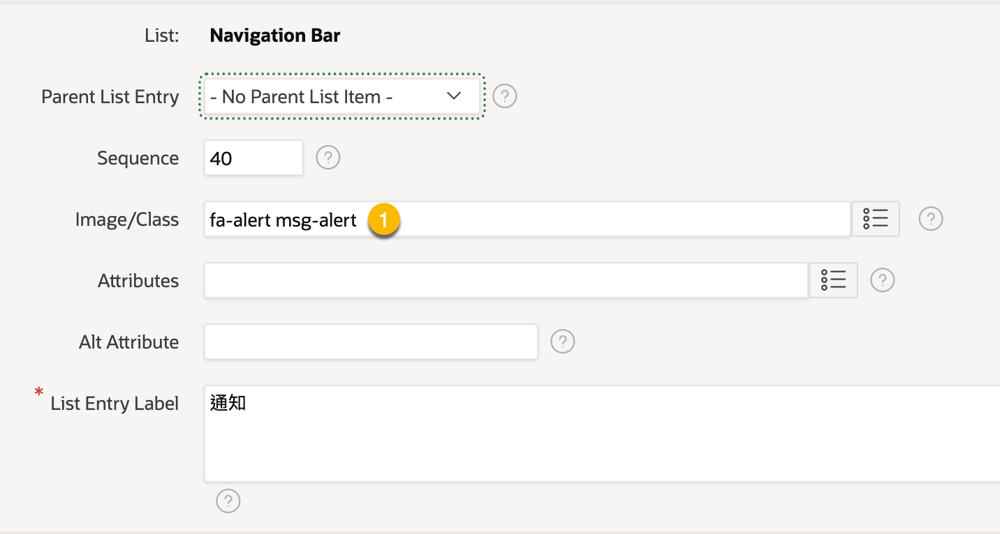

# 於載入頁面時，顯示通知訊息 5 秒後自動消失

## 於載入頁面時，顯示通知訊息 5 秒後自動消失


### User Story


### 原理

1. 在 Oracle Apex 的 page 的 DOM 中新增一個元素, 用來顯示通知訊息。
2. 於載入頁面時, 由 page/application process 輸出 JavaScript code, 要求 browser 執行 JavaScript code, 以顯示通知訊息。
3. 使用 JQuery, 先選擇先前新增的元素, 再使用 JQuery 的方法 `show().delay(5000).fadeOut()` 來顯示通知訊息。

### 實作步驟

#### Step 1: 在 App 的 Navigation Tool Bar 中新增一個 Icon, 做為訊息通知的父元素


在 Image/Class 欄位中, 除了 Icon class name 之外, 還要加上一個自訂的 class name `msg-alert`, 以便於 JavaScript code 中選擇此元素。



#### Step 2: 設定傳訊息通知 CSS

我們會在相對於父元素的某個位置, 顯示訊息通知。

使用 `absolute` 定位, 並設定 `top`, `right` 的值, 來控制訊息通知的位置。 使用 `absolute` 定位, 不會佔據父元素的位置, 會浮在父元素的上方。 「訊息通知」 會顯示在父元素下方 30px 的位置, 並靠右對齊。


預設不顯示 (`display:none`), 並設定背景顏色, 文字顏色, 邊框等樣式。 之後, 我們會使用 JavaScript code, 來控制「訊息通知」的顯示與消失。

所需的 CSS 如下:

```css
.msg-notification {
    display: none;
    position: absolute;
    top: 60px;
    right: 0px;
    color: black;
    background-color: lightyellow;
    padding: 10px;
    border: 1px solid #ccc;
    border-radius: 5px;
}
```

#### Step 3: 將 CSS 加入到 App 的靜態檔案中, 並將其引入到 App 中

Path: Shared Components > Static Application Files > (B)Create File


輸入 File Name 並按下 Create 按鈕, 可建立一個新的 CSS file 並編輯其內容。

若已在外部編輯好 CSS file, 可直接 Drag & Drop 檔案到此頁面中。

我們在 File Name 中輸入 `notification.css`:

&#x20;

接著, 在 CSS file 中貼上上述的 CSS code:


Oracle Apex 會 minify CSS code, 以減少檔案大小。在 File Name 欄位下方有一個 Reference 欄位, 可以看到 minify 後的 CSS 連結。

複制此連結供後續使用。

接著要將 CSS 引入到 App 中。

路徑 Shared Components > User Interface Attributes > CSS

在 File URLs 欄位中, 貼上剛才複制的 minify 後的 CSS 連結。


#### Step 4: 設定新增「訊息通知」元素的 JavaScript code 及其它輔助 function

在頁面載入時, 會執行以下動作:

1. 選取父元素, 使用 `.msg-alert` 元素的上兩層元素為父元素。
2. 建立一個新的 div 元素, 並設定其內容為 `Message Placeholder`
3. 設定 div 元素的 class name 為 `msg-notification`, 以便套用 CSS 樣式
4. 將 div 元素加入到父元素中

此外, 定義一個輔助 function `showMessage(message)`, 用來顯示訊息通知。

此 function 會選取 class name 為 `msg-notification` 的元素, 並設定其內容為 message 引數的值。 最後, 使用 JQuery 的方法 `show().delay(5000).fadeOut()` 來顯示訊息通知。

`message` 引數的內容, 除了文字之外, 也可以含有 HTML 元素, 例如 `<a href="...">link</a>`, 因為 `innerHTML` 會將其解析為 HTML 元素。

```javascript
/**
 * Create a new div element and position it relative to the msg-alert element.
 * 
 * The following code will be executed when the page is loaded.
 */

// 1. Get the parent element. In this case, it is the .msg-alert element
let msgAlert = document.querySelector('.msg-alert');
// 不可以直接在msg-alert元素上添加新元素，因为 msg-alert 是 anchor 元素。若在 anchor 元素上添加 anchor 元素, 子元素的 anchor 無法被點擊。
let parent = msgAlert.parentElement.parentElement;

// 2. create a new div element for the message
let msgDiv = document.createElement('div');
msgDiv.innerHTML = 'Message Placeholder';

// 3. set the class name for the div element
// The class name should be the same as the one in the CSS file in the previous step.
msgDiv.classList.add('msg-notification');

// 4. append the div element to the body
parent.appendChild(msgDiv);


// The helper function to show the message
function showMessage(message) {
    let msgDiv = document.querySelector('.msg-notification');
    msgDiv.innerHTML = message;
    $('.msg-notification').show().delay(5000).fadeOut();
}
```

此 JS 程式會將「訊息通知」元素加下 `<li class="t-NavigationBar-item>` 元素內, 而不是 `<a class="msg-alert">` 元素內, 以避免在 anchor 元素內添加 anchor 元素。


#### Step 5: 將 JavaScript code 加入到 App 的靜態檔案中, 並將其引入到 App 中

此步驟的操作方式和 Step 3 類似。

建立 static JavaScript file 的路徑: Shared Components > Static Application Files > (B)Create File

將前一步驟的 JavaScript code 複制貼上到此檔案中:


複製 minify 後的 JavaScript 連結, 供後續使用。

接著, 將 JavaScript file 引入到 App 中, 路徑: Shared Components > User Interface Attributes > JavaScript


#### Step 6: 觀察 custom js 及 css file 的載入順序。

Custom CSS file 會在 Apex Page 中的 `<head>` 中引入


Custom JS file 會在 Apex Page 中的 `<body>` 的最後引入


我們後續用 PL/SQL code 來輸出的 JavaScript code 會在 custom js file 之後載入。 如此, 我們才能正確的呼叫 `showMessage()` function。

#### Step 7: 在 App 的 Page 中, 新增一個 Application Process, 用來輸出 JavaScript code

我們會去 `test_orders` table 中, 查詢是否有狀態 `new` 的訂單。

如果有一筆以上的訂單, 則輸出文字 `You have [n] new orders.` .

這個 App Process 的執行時間點設為 `On Load: After Footer (page template footer)`. 這個時間點設定後重要, 因為要確保 先前的 custom js file 已經載入, 才能呼叫 `showMessage()` function。

若將 App Process 的執行時間點設為 `On Load: After Body Regions`, 則會發生錯誤, 因為 custom js file 尚未載入。

所需要的 PL/SQL code 如下:

```sql
declare 

v_order_count number;
-- v_js_str varchar2(1000) :=  '<script> apex.message.alert("#MSG#"); </script>';
-- Call the javascript function showMessage
v_js_str varchar2(1000) :=  '<script> showMessage("#MSG#") </script>';
v_msg varchar2(1000);

begin
apex_debug.enable(apex_debug.c_log_level_info);

-- Check if any new orders in the test_orders table

select count(*) into v_order_count
from test_orders
where order_status = 'new';

if v_order_count > 0 then
    -- show message 
    v_msg := 'You have ' || v_order_count || ' orders.';
    v_js_str := replace(v_js_str, '#MSG#', v_msg);
    apex_debug.info('== Notification: %s', v_js_str);
    htp.p(v_js_str);
end if;

end;
```

在上述的 PL/SQL code 中, 使用 `htp.p()` 來輸出 JavaScript code, 以呼叫 `showMessage()` function。 這會在 Page 中輸出一段 JavaScript code, 例如:

```javascript
<script> showMessage("You have 1 orders.") </script>
```

如此, 便會呼叫 `showMessage()` function, 並顯示訊息通知。

要新增 Application Process, 路徑: App > Shared Components > Application Processes > (B)Create


接著設定 Process 的 `Process Point` 及 Name:


再設定 Process 的 Source, 將上述的 PL/SQL code 貼上:


若要限制此 Process 的執行範圍, 可以設定 `Conditions`:


例如, 只有在特定的 Page 中執行此 Process:


#### Step 8: 測試

登入 APP 後, 進到首頁或任何頁面, 若 `test_orders` table 中有狀態為 `new` 的訂單, 則會顯示訊息通知。

### 顯示可點擊的訊息通知

修改前述幾個地方可以讓「訊息通知」內含有可點擊的連結, 例如點擊後查看最新的一筆訂單。


JavaScript 和 CSS 的部分不需要修改, 只需要修改 PL/SQL code。

我們首先將產生「訊息通知」的動作抽取出來, 成為 2 個 local (nested) functions.

* `showOrderCount` function 回傳有新訂單的訊息字串
* `showNewestOrderURL` function 回傳最新訂單的 URL, user 可以點擊連結查看最新的訂單。

`showOrderCount` function 的內容如下:

```sql
function showOrderCount(p_order_count in number) return varchar2 is
begin
    return '<p> You have ' || p_order_count || ' orders. </p>';
end;
```

`showNewestOrderURL` function 的內容如下:

```sql
function showNewestOrderURL(p_page_id number, p_item_name varchar2, p_order_id number) RETURN varchar2 is
    l_msg varchar2(2000);
    l_url varchar2(2000); 
begin
    
    l_url := apex_page.get_url(p_page => p_page_id, 
                                p_items => p_item_name,
                                p_values => p_order_id);
    l_msg := q'[<p><a href=']' || l_url || q'[' aria-hidden='false' >]' ||  '您有最新訂單 ID ' || p_order_id || '</a> </p>';
    return l_msg;
end;
```

此程式中的重點:

* 使用 `apex_page.get_url()` 來取得 URL. `p_page` 是目的頁面編號, `p_items` 是目的頁面的 item name 同時也是 primary key item, `p_values` 是 primary key 的值。
* `l_msg` 是產生的 anchor 元素. 組合 URL 字串時, 屬性值要用單引號包住, 而不是雙引號。因為 PL/SQL 的 `htp.p` 產生字串內容時是使用雙引號。

所以, 修改後的 PL/SQL code 如下:

```sql
declare 

v_order_count number;
v_order_id number;
-- v_js_str varchar2(1000) :=  '<script> apex.message.alert("#MSG#"); </script>';
-- Call the javascript function showMessage
v_js_str varchar2(1000) :=  '<script> showMessage("#MSG#") </script>';
v_msg varchar2(1000);

function showOrderCount(p_order_count in number) return varchar2 is
begin
    return '<p> You have ' || p_order_count || ' orders. </p>';
end;

function showNewestOrderURL(p_page_id number, p_item_name varchar2, p_order_id number) RETURN varchar2 is
    l_msg varchar2(2000);
    l_url varchar2(2000); 
begin
    
    l_url := apex_page.get_url(p_page => p_page_id, 
                                p_items => p_item_name,
                                p_values => p_order_id);
    l_msg := q'[<p><a href=']' || l_url || q'[' aria-hidden='false' >]' ||  '您有最新訂單 ID ' || p_order_id || '</a> </p>';
    return l_msg;
end;

begin
apex_debug.enable(apex_debug.c_log_level_info);

-- Check if any new orders in the test_orders table
-- Select the total number of new orders
select count(*) into v_order_count
from test_orders
where order_status = 'new';

-- Select the newest order id
select order_id into v_order_id
from test_orders
where order_status = 'new'
order by order_datetime desc
fetch first 1 row only;

if v_order_count > 0 then
    -- show message 
    v_msg := showOrderCount(v_order_count);

    -- Assume the page 2 display the order detail
    v_msg := v_msg || showNewestOrderURL(2, 'P2_ORDER_ID', v_order_id);
    v_js_str := replace(v_js_str, '#MSG#', v_msg);
    apex_debug.info('== Notification: %s', v_js_str);
    htp.p(v_js_str);
end if;

end;
```

### 總結

* 透過 JavaScript code, 我們在 Navigation Tool Bar 的某個元素下，新增一個元素，用來顯示訊息通知。
* 這些需要的 JavaScript code 和 CSS code, 上傳到 App 的靜態檔案中, 並引入到 App 中。
* App 中的每個頁面都會載入這些靜態檔案。
* 使用 PL/SQL code, 在 App Process 中輸出 JavaScript code, 以呼叫 JavaScript function, 來顯示訊息通知。
* 若要產生可點擊的訊息通知, 可以在 PL/SQL code 中, 產生包含 anchor 元素的 HTML 字串。
* 使用 `apex_page.get_url()` 來產生 URL 字串, 以便使用者點擊連結查看最新的訂單。
