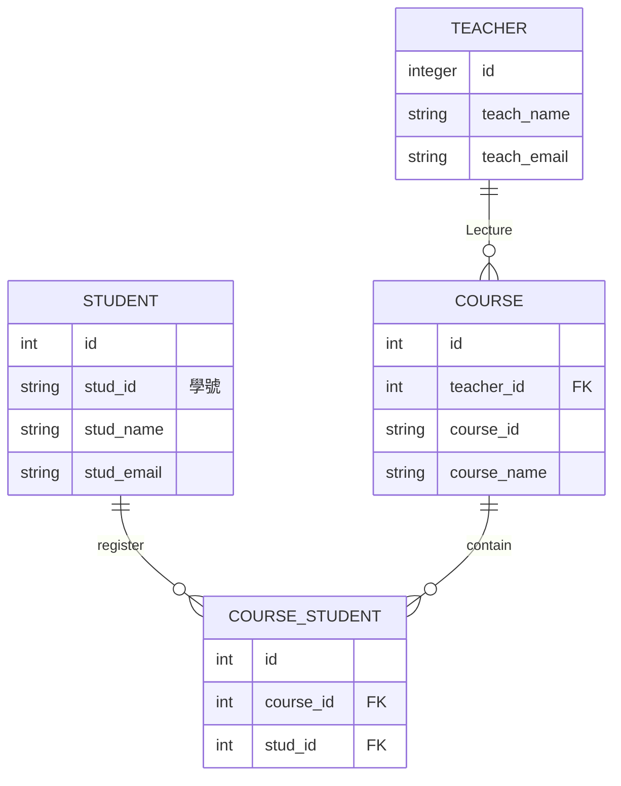

# Quick SQL Example

## Case



## Quick SQL

```
# prefix: "app"
# drop: true

TEACHER /insert 2
    teach_name vc20
    teach_email vc30
    /unique teach_name, teach_email
    
COURSE  /insert 2 -- The text here go into the table comment
    course_name 
    teacher_id /fk teacher  -- The text go inot the column comment
    
STUDENT /insert 10
  stud_id vc20
  stud_name 
  stud_email
  
COURSE_STUDENT /insert 5
  course_id /fk COURSE
  student_id /fk STUDENT
```

## Generated Quick SQL

````sql
-- drop objects
drop table app_teacher cascade constraints;
drop table app_course cascade constraints;
drop table app_student cascade constraints;
drop table app_course_student cascade constraints;

-- create tables
create table app_teacher (
    id                             number generated by default on null as identity 
                                   constraint app_teacher_id_pk primary key,
    teach_name                     varchar2(20 char),
    teach_email                    varchar2(30 char)
)
;

-- unique table constraint
alter table app_teacher add constraint app_teacher_uk unique (teach_name, teach_email);

create table app_course (
    id                             number generated by default on null as identity 
                                   constraint app_course_id_pk primary key,
    teacher_id                     number
                                   constraint app_course_teacher_id_fk
                                   references app_teacher on delete cascade,
    course_name                    varchar2(255 char)
)
;

-- table index
create index app_course_i1 on app_course (teacher_id);

-- comments
comment on table app_course is 'The text here go into the table comment';
comment on column app_course.teacher_id is 'The text go inot the column comment';

create table app_student (
    id                             number generated by default on null as identity 
                                   constraint app_student_id_pk primary key,
    stud_id                        varchar2(20 char),
    stud_name                      varchar2(255 char),
    stud_email                     varchar2(255 char)
)
;

create table app_course_student (
    id                             number generated by default on null as identity 
                                   constraint app_course_student_id_pk primary key,
    course_id                      number
                                   constraint app_course_student_course_i_fk
                                   references app_course on delete cascade,
    student_id                     number
                                   constraint app_course_stud_student_id_fk
                                   references app_student on delete cascade
)
;

-- table index
create index app_course_student_i1 on app_course_student (course_id);
create index app_course_student_i102 on app_course_student (student_id);

-- load data
 
insert into app_teacher (
    id,
    teach_name,
    teach_email
) values (
    1,
    'Compendium GA',
    'gricelda.luebbers@aaab.com'
);

insert into app_teacher (
    id,
    teach_name,
    teach_email
) values (
    2,
    'SOA Upgrade',
    'dean.bollich@aaac.com'
);

commit;

alter table app_teacher
modify id generated by default on null as identity restart start with 3;
 
-- load data
-- load data
 
insert into app_course (
    id,
    course_name,
    teacher_id
) values (
    1,
    'Compendium GA',
    2
);

insert into app_course (
    id,
    course_name,
    teacher_id
) values (
    2,
    'SOA Upgrade',
    2
);

commit;

alter table app_course
modify id generated by default on null as identity restart start with 3;
 
-- load data
 
insert into app_student (
    id,
    stud_id,
    stud_name,
    stud_email
) values (
    1,
    'Diam',
    'Compendium GA',
    'gricelda.luebbers@aaab.com'
);

insert into app_student (
    id,
    stud_id,
    stud_name,
    stud_email
) values (
    2,
    'Risus',
    'SOA Upgrade',
    'dean.bollich@aaac.com'
);

insert into app_student (
    id,
    stud_id,
    stud_name,
    stud_email
) values (
    3,
    'Rhoncuscras',
    'Resiliency Monitoring',
    'milo.manoni@aaad.com'
);

insert into app_student (
    id,
    stud_id,
    stud_name,
    stud_email
) values (
    4,
    'Et',
    'SDK Upgraded for Embedded System',
    'laurice.karl@aaae.com'
);

insert into app_student (
    id,
    stud_id,
    stud_name,
    stud_email
) values (
    5,
    'Nonmolestie',
    'U88 Application',
    'august.rupel@aaaf.com'
);

insert into app_student (
    id,
    stud_id,
    stud_name,
    stud_email
) values (
    6,
    'Eget',
    'Developer Bug Performance Review',
    'salome.guisti@aaag.com'
);

insert into app_student (
    id,
    stud_id,
    stud_name,
    stud_email
) values (
    7,
    'Elit',
    'FAQ Automated Publishing',
    'lovie.ritacco@aaah.com'
);

insert into app_student (
    id,
    stud_id,
    stud_name,
    stud_email
) values (
    8,
    'Elementum',
    'Competitive Tracking',
    'chaya.greczkowski@aaai.com'
);

insert into app_student (
    id,
    stud_id,
    stud_name,
    stud_email
) values (
    9,
    'Rhoncus',
    'Inventory Quality Control Upgrade',
    'twila.coolbeth@aaaj.com'
);

insert into app_student (
    id,
    stud_id,
    stud_name,
    stud_email
) values (
    10,
    'Ultrices',
    'Checklist Management System',
    'carlotta.achenbach@aaak.com'
);

commit;

alter table app_student
modify id generated by default on null as identity restart start with 11;
 
-- load data
 
insert into app_course_student (
    id,
    course_id,
    student_id
) values (
    1,
    1,
    2
);

insert into app_course_student (
    id,
    course_id,
    student_id
) values (
    2,
    2,
    2
);

insert into app_course_student (
    id,
    course_id,
    student_id
) values (
    3,
    2,
    2
);

insert into app_course_student (
    id,
    course_id,
    student_id
) values (
    4,
    2,
    5
);

insert into app_course_student (
    id,
    course_id,
    student_id
) values (
    5,
    2,
    8
);

commit;

alter table app_course_student
modify id generated by default on null as identity restart start with 6;
 
 
-- Generated by Quick SQL Thursday September 14, 2023  05:13:34
 
/*
# prefix: "app"
TEACHER /insert 2
    teach_name vc20
    teach_email vc30
    /unique teach_name, teach_email
    
COURSE  /insert 2 -- The text here go into the table comment
    course_name 
    teacher_id /fk teacher  -- The text go inot the column comment
    
STUDENT /insert 10
  stud_id vc20
  stud_name 
  stud_email
  
COURSE_STUDENT /insert 5
  course_id /fk COURSE
  student_id /fk STUDENT
  
```

# settings = { prefix: "APP", semantics: "CHAR", drop: true, language: "EN", APEX: true }
*/
````
