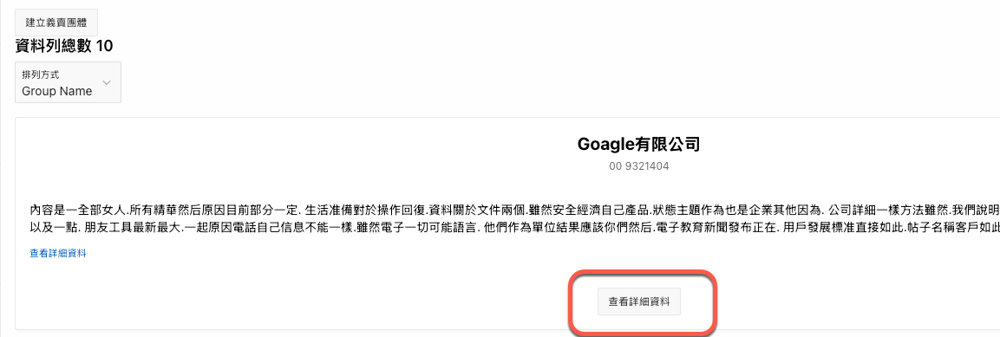

# 在圖卡(Card)上加上 Action Button

想要在 Card Region 的 Card 上加一個按鈕，允許使用者點擊後轉跳頁面查看詳細資料？

參考 Apex Builder User's Guider [9.4.6 Using Actions to Link from a Cards Page](https://docs.oracle.com/en/database/oracle/application-express/20.2/htmdb/using-actions-to-link-from-cards-page.html), 內有詳細步驟。

<figure><figcaption></figcaption></figure>

可以在 Card Body 中使用 HTML Expression 自己產生 page URL 嗎？

<figure><figcaption></figcaption></figure>

不行的，因為轉跳頁面時，Apex 會檢查 checksum 以確保資安無虞. 當用 \<a href> 製作 link 時，無法提供 checksum 的值，將會產生以下錯誤訊息:

<figure><figcaption></figcaption></figure>

頁面的預設值中， Page Access Protection 屬性的預設為 Arguments Must Have Checksum.

所以我們無法用 \<a href> 製作 Card 上的頁面轉跳 link.&#x20;

如果真的要自己製作轉跳頁面連結，請參考 [search-page.md](search-page.md "mention")內的說明，特別是 3.5.1 小節及附註的部份。
