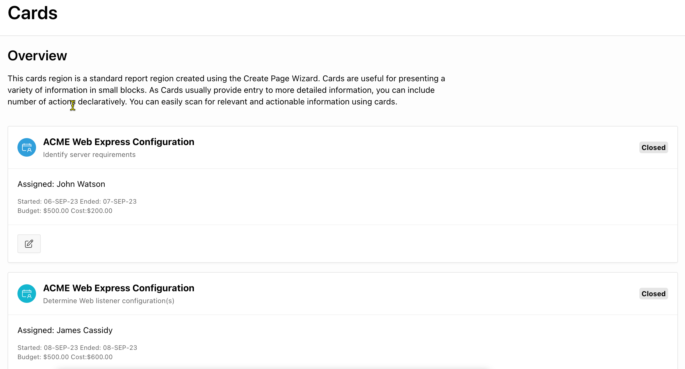
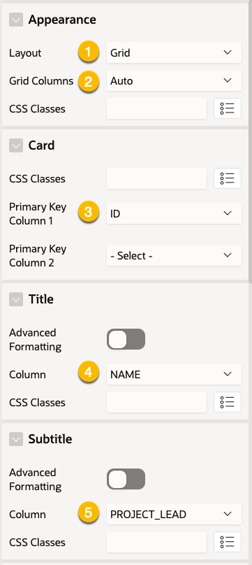
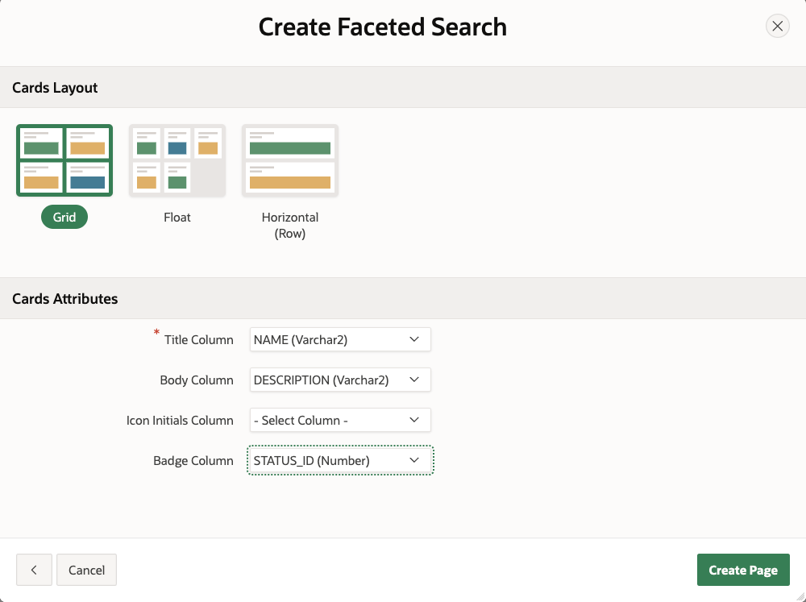

# 圖卡顯示搜㝷結果

## 什麼是 Cards Region?

- Cards Region 是一種顯示區域，它可以讓使用者以圖卡的方式來瀏覽搜尋結果。
  - 一個圖卡代表一個區塊(block)


- 圖卡內包含的元素:
  - 主標(title)及次標(sub-title)
  - 主文(body)及次文(secondary body)
  - Icon 或 Badge (徽章)
  - 圖片
  - 動作按鈕


## 如何設定 Cards Region 中各 Block 內容元素？

- 一個 Block 對應到 Query 中的一筆資料。
- Block 內的各元素對應到資料中的各欄位。

- 在 Card Regions 的 Attributes 中設定 block 元素與資料來源的欄位間的對應關係。

## Cards 的 Layout 方式

Cards Region 提供了三種 Layout 方式: 網格(Grid)、浮動(Float)及水平(Horizontal)。

- 網格(Grid)：設定網格的欄位數，由左至右排列。每個 block 的大小皆相同。


- 浮動(Float)：每個 block 依據內容的大小，由左至右流動。每個 block 的大小不一定相同。


- 水平(Horizontal)：每個 block 一個列，由上至下排列。



## 手動設定 Cards Region 

使用 EBA_PROJECTS 表格來示範。


### Step 1. 新增 一個 blank page. 接著在 page 的 body 中加入一個 Cards Region。

Region property:
- Identification
  - Title： Projects
  - Type： Cards


### Step 2. 設定資料來源  

Region Property:
- Source
  - Type: Table/View (default)
  - Table Name: EBA_PROJECTS


### Step 3. 設定  block 的元素與資料來源的欄位間的對應關係。

Region Attributes:
- Appearance
  - Layout: Grid
  - Grid Columns: Auto
- Card 
  - Primary Key Column 1: ID  (對 Table PK)
- Title
  - Column: Name (顯示專案名稱)
- Subtitle
  - Column: Project_Lead 



- Body (使用 Advanced Formatting, 組合不同的欄位資料，以 html 格式顯示)
  - Advanced Formatting: Enabled
  - HTML Expression:

```html
<p> <b> &BUDGET. </b> </p>
<p> &DESCRIPTION. </p>
```


- Icon 及 Badge 的設定 


### Step 4. 儲存頁面，並執行。即可完成


## 練習

請使用 Page Wizard 來建立一個 Faceted Search 頁面，並使用 Cards Region 來顯示搜尋結果。

改使用 Cards Region 來顯示搜尋結果。


在 Wizard 中初步設定 Layout 及一些欄位的顯示設定。之後到 Page Designer 進一步設定 Cards Region 的屬性。


在 Page Designer 中進一步設定 Cards Region 的其他屬性。


