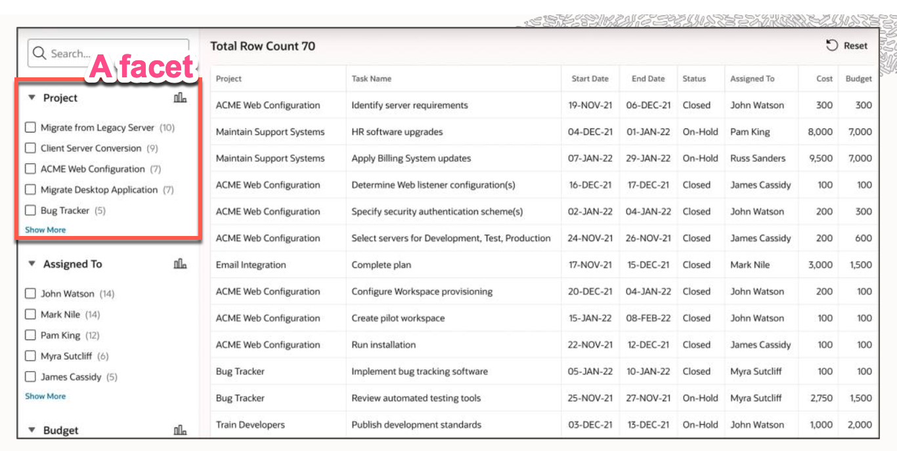
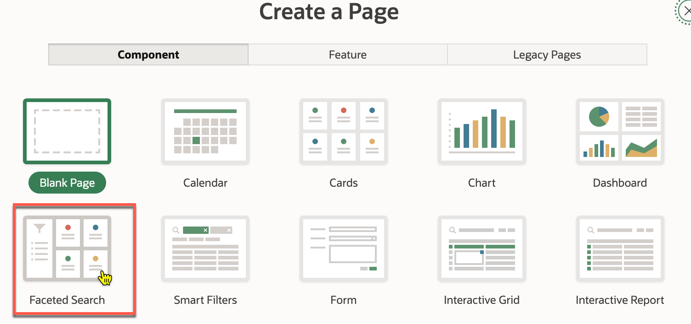
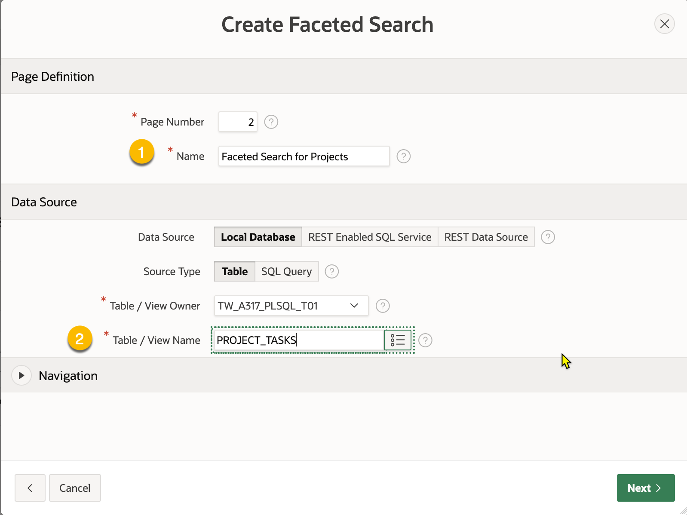
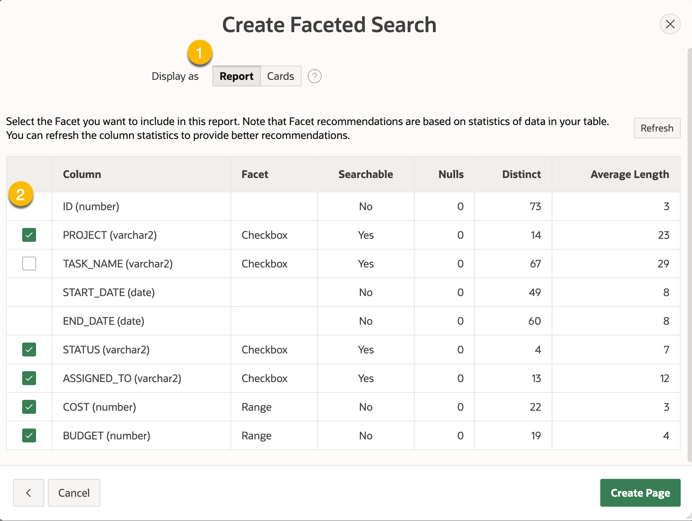
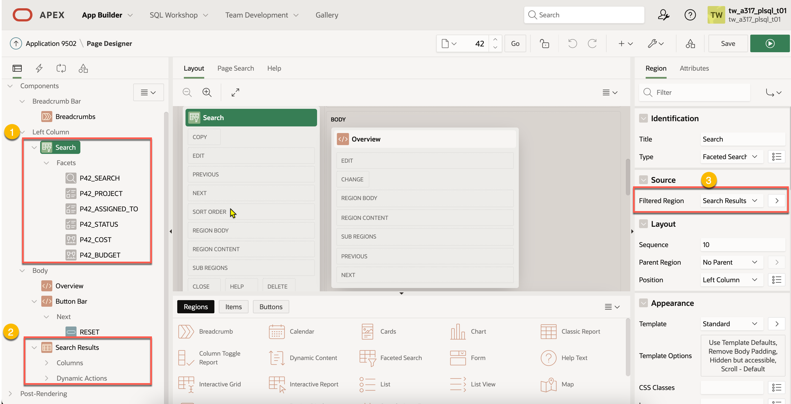

# Faceted Search 分面搜尋

## 什麼是 Faceted Search?

- Faceted Search 是一種搜尋方式，它可以讓使用者在搜尋結果中進行篩選。
- 這種搜尋方式通常會在搜尋結果的側邊顯示篩選條件，使用者可以透過這些條件來縮小搜尋範圍。

## 使用 Page Wizard 來建立 Faceted Search

- 使用 Table `EBA_PROJECTS` 來建立 Faceted Search
- 瀏覽到 SQL Workshop > Utilities > Sample Datasets 下安裝 Project Data 

### Step 1. 在 App Home 下點選 (B)[Create Page] 建立新頁面

### Step 2. 選擇 Faceted Search  

### Step 3. 設定頁面屬性。

包括: Page Definition, Data Source (資料來源)

- Name： Faceted Search for Projects 
- Table/View Name： PROJECT_TASKS

### Step 4. 選擇顯示的方式。

可使用 Classic Report 或 Cards Region 來顯示搜尋結果。

我們這次選擇 Classic Report。

### Step 5. 選擇要顯示的分面欄位。

從表格欄位中選擇特定的數個欄位來顯示在 Faceted Search 的篩選條件中。

系統會使用該欄位的不同值來該作為分面的篩選條件。

注意，並不是所有的欄位都適合作為分面的篩選條件。只有表格內 Searchable 欄位為 Yes 的才能被選擇。

### Step 6. 點選 (B)[Create Page] 來建立頁面。

## Faceted Search 的結構

- Faceted Search 的組成包括 Search Region 及 Search Results Region。

- Search Region:
  - 在 Search Region 中可以設定使用那些欄位來作為篩選條件。
  - 使用 Search Region 中的 Source > Filtered Region 屬性指定其對應的 Search Results Region。

- Search Results Region:
  - 顯示搜尋結果。
  - 可用 Classic Report 或 Cards Region 來顯示搜尋結果。

