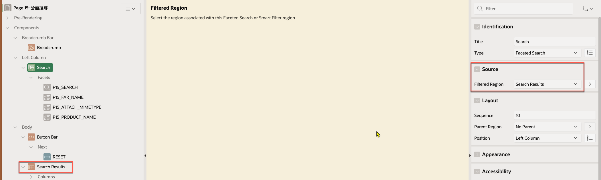
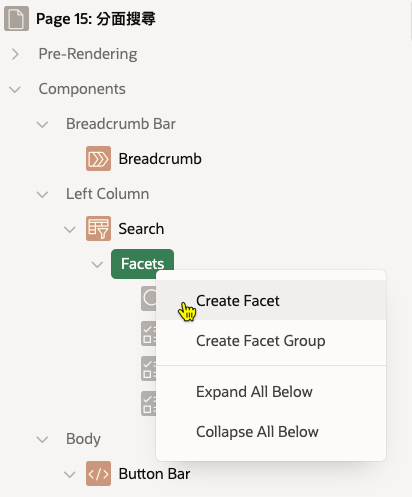
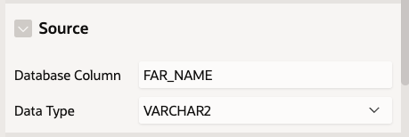
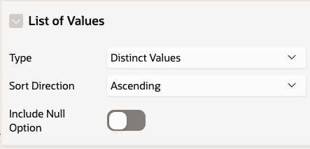
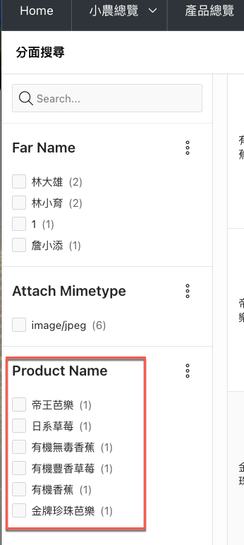
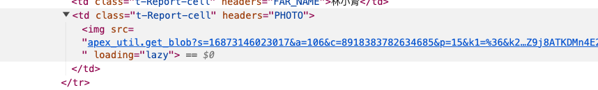
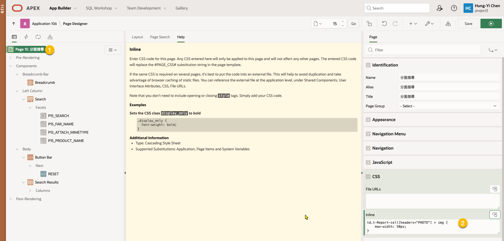
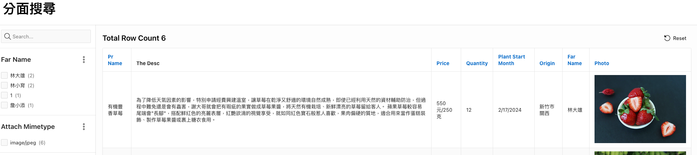

# 調整 Faceted Search 的 Facet 欄位及Classic Report 中圖片大小

## User Story 

已使用 Wizard 建立 Faceted Search Report. 但是想要增加一個資料庫欄位於 Facet 欄位中。
另外, 在 Search Report 中使用 Classic Report 呈現結果，report 欄位中有圖片，想要調整圖片大小。


## 原理

Faceted Search 由兩個重要部份組成: Faceted Search region 及 Search Result.

Faceted Search region 下可以有多個 Facet 欄位。

Search Result 允許是: Classic Report 或者 Card Region.

資料來源是放在 Search Result 中, 不是 Faceted Search region.

要連結 Faceted Search region 與 Search Result, 需要在 Faceted Search region 的 Source > Filtered Region 屬性中指定 Search Result 的 Region 名稱。



那 Facet 欄位如何設定呢？在 Faceted Search region 的 Facets 節點下新增一個 Facet 欄位。



接著設定 Facet 欄位的 Source 屬性:
- Database Column: 關聯的 Search Result 中的資料庫欄位名稱
- Data Type: 該欄位的資料型態



再設定 Facet 欄位的 List of Values 屬性:
- Type: Distinct Values 




這樣就完成了 Facet 欄位的設定。



若需要進一步瞭解，可參考 [1].

## 調整 Classic Report 中圖片大小

若在 Classic Report 中使用圖片，可以透過 CSS 調整圖片大小。

如何知道圖片欄位的 tag 及 css 呢？可以透過瀏覽器的開發者工具來查看頁面元素。

例如，以下是一個 Classic Report 中的圖片欄位:



選取圖片的 css selector 為 `td.t-Report-cell[headers="PHOTO"]`.

利用 width 屬性調整圖片大小. 

所以需要的 CSS 樣式為:

```css
td.t-Report-cell[headers="PHOTO"] > img {
  max-width: 100%;
}
```

接著，將 CSS 樣式加入到頁面的 CSS Inline 屬性中。




這樣就完成了圖片大小的調整。  




## References

[1] [APEX 19.2 - Faceted Search](https://blogs.oracle.com/apex/post/apex-192-faceted-search)