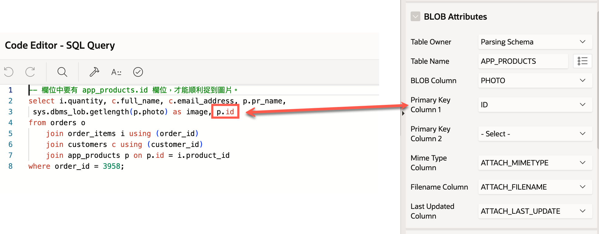

# 在 Interactive Report 中顯示圖片

## 原理

有兩種方法可以在 Interactive Report 中顯示圖片:
1. 使用 Display Image column[1]
2. 使用 HTML Expression column

## Display Image column

在資料來源中提供兩個欄位。第一個為圖片的 PK 值。第二個為數值欄位，通常是 BLOB 欄位的長度。當數值欄位的值大於 0 時，則顯示圖片，否則不顯示。

```sql
select ..., 
    image_pk_id,
    dbms_lob.getlength(image_blob) as image
from ...
```
對於 image 欄位, 設定使用 Display Image 類型, 並設定圖片來源的相關欄位, 包括: 
- Table name
- BLOB column
- Primary key column
- MIME type column
- Filename column
- Last update column

其中，最重要的，Primary key column 必需程和資料來源的 PK 欄位相同。



## HTML Expression column

假設有提供 RESTful Web Service 的端點 `project3/prod_img/fetch/id` 來取得圖片。

那麼在資料來源中提供一個空白常數欄位:

```sql
select ...,
    ID, 
    FILENAME, 
    '' as image
from ...
```
接著, 對此欄位設定使用 HTML Expression 類型， 其 HTML Expression 如下:
```html

```

其中, `&ID.` 和 `&FILENAME.` 是資料來源的欄位名稱。

這樣就可以在 Interactive Report 中顯示圖片了。

這個方法的好處是可以使用任何圖片來源，例如 RESTful Web Service, 或是其他網站的圖片。且做法簡單，不需要設定太多的屬性。缺點是要另外設定 RESTful Web Service 的端點。

## References

1.  [8.13.3 Displaying a BLOB Image in a Report | App Builder User's Guide 23.1](https://docs.oracle.com/en/database/oracle/apex/23.1/htmdb/understanding-blob-support-in-forms-and-reports.html#GUID-F9FC68B1-EAF5-47F7-862A-5AF157E854DE)