# Report 的每一列顯示可點擊的按鈕

功能需求:
- Report 顯示訂單資料時，在每列增加「已付款」的按鈕可以點擊

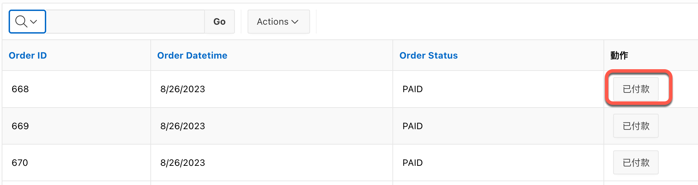

Main ref: [Apex Interactive Report: A link column with a clickable icon | Official Pythian®® Blog](https://www.pythian.com/blog/technical-track/apex-interactive-report-a-link-column-with-a-clickable-icon)


# 原理

- 在 Interactive Report 中，若要在每列的資料後面加上一個按鈕，可以透過「Link」型態欄位來達成
- 在 Link column 中在 Link Attribute 加入 `data-*` 屬性，存放 record 的 PK 值
- 設定一個 Dynamic Action, 當 click 時觸發。 
- 此 Dynamic Action 會使用 JQuery 取得 Triggering Element 的 `data-*` 屬性，並將其值寫入到一個 Hidden Item 中
- 接著, 再執行 PL/SQL Code, 依 Hidden Item 的值來執行相對應的程式
- 接著, 再 refresh region 以更新頁面


# 實作步驟

## 資料表
使用 `ORDERS` 資料表，包含以下欄位:

```
Name             Null?    Type          
---------------- -------- ------------- 
ORDER_ID         NOT NULL NUMBER        
ORDER_DATETIME   NOT NULL TIMESTAMP(6)  
CUSTOMER_ID      NOT NULL NUMBER        
ORDER_STATUS     NOT NULL VARCHAR2(10)  
STORE_ID         NOT NULL NUMBER        
ADDRESS                   VARCHAR2(255) 
BILL_TYPE                 VARCHAR2(50)  
DONATION_OBJECTS          VARCHAR2(255) 
MAIL                      VARCHAR2(255) 
NAME                      VARCHAR2(255) 
NUMBER_HEADER             VARCHAR2(255) 
PHONE                     VARCHAR2(20)  
UNIFORM_NUMBERS           VARCHAR2(20)  
VEHICLE                   VARCHAR2(50)
```

## S1: 建立 Interactive Report

Source > SQL Query:

```sql
select ORDER_ID,
       ORDER_DATETIME,
       CUSTOMER_ID,
       ORDER_STATUS, 
       '<span class="t-Button-label">已付款</span>' "動作"
  from ORDERS
```
"動作" 欄位的 `<span>` 的值可以到 [Universal Theme 的 Button Builder](https://apex.oracle.com/pls/apex/r/apex_pm/ut232/button-builder) 來設定. 

Button Builder 的畫面如下:

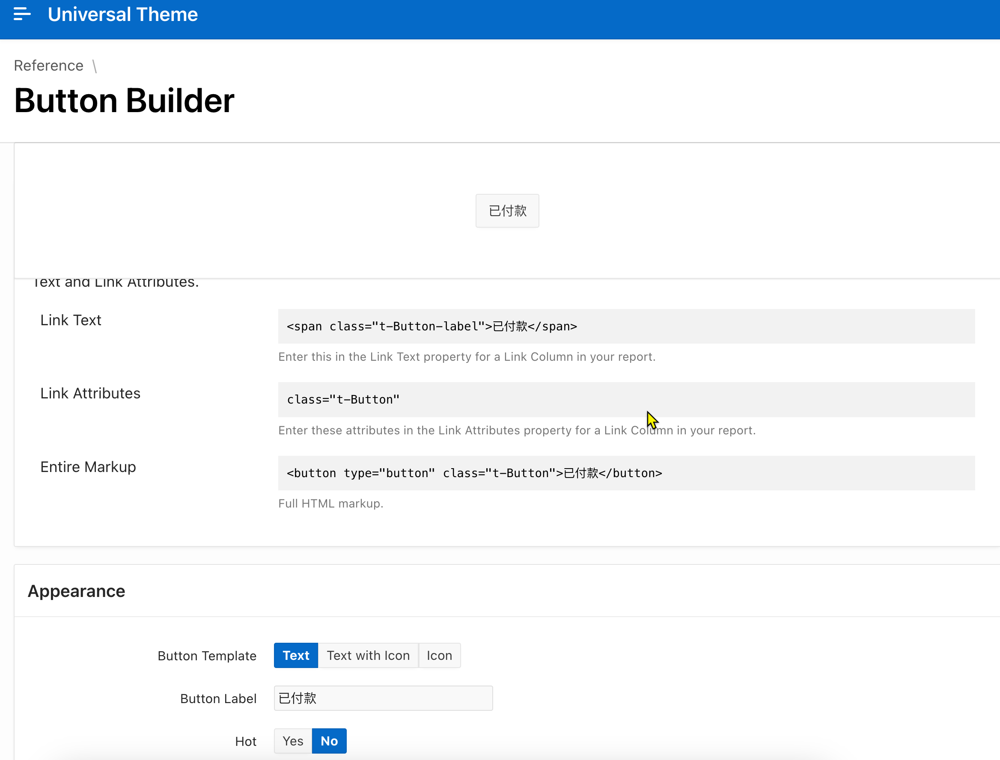

## S2: 設定 "動作" 欄位的 Link Column 屬性

"動作" 欄位的屬性設定:
- Identification > Type: Link

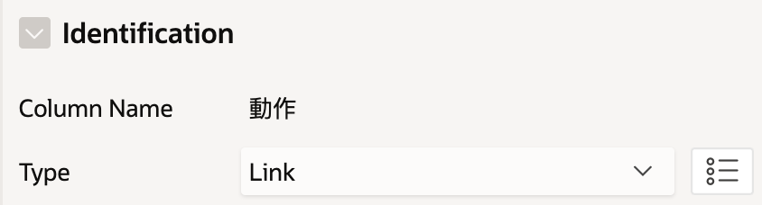

- Link
  - Target
    - Type: URL
    - URL: `javascript:void(0)`
  - Link Attributes: ` class="t-Button order-paid" data-id=#ORDER_ID#` 
    - 注意: `#ORDER_ID#` 是欄位名稱; `order-paid` 是手動加入的 class 名稱, 用來在 Dynamic Action 中做為 selector 來使用

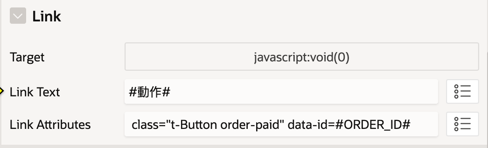


- Security > Escape special characters: False

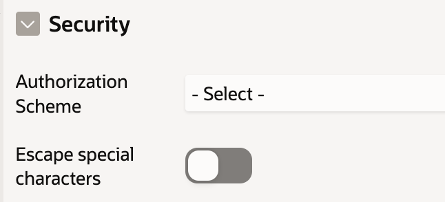

- Enable Users To
  - 取消勾選所有選項

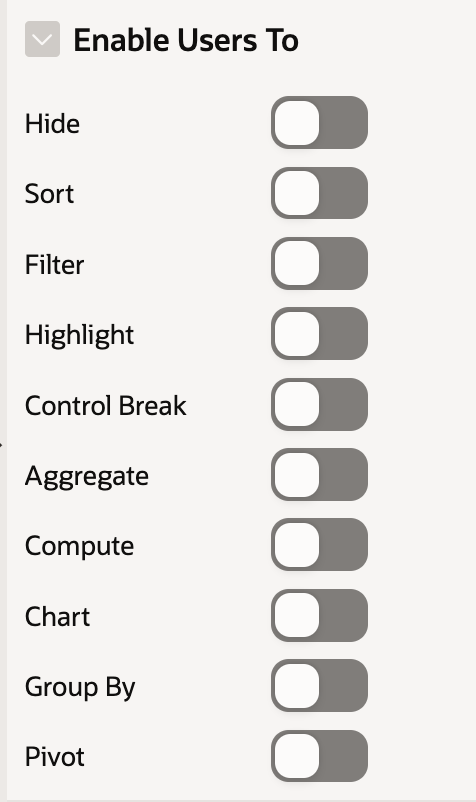


## S3: 建立一個 Region 並放入一個 Hidden Item

這裡的 Item Name: P2_SELECTED_ID

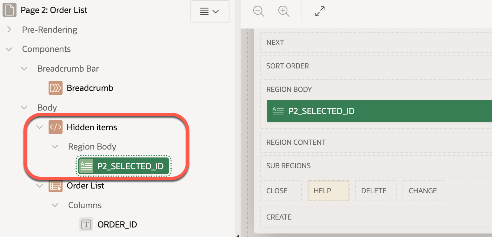


## S4: 測試目前設定

- 點擊 "已付款" 按鈕，應該不會有任何反應

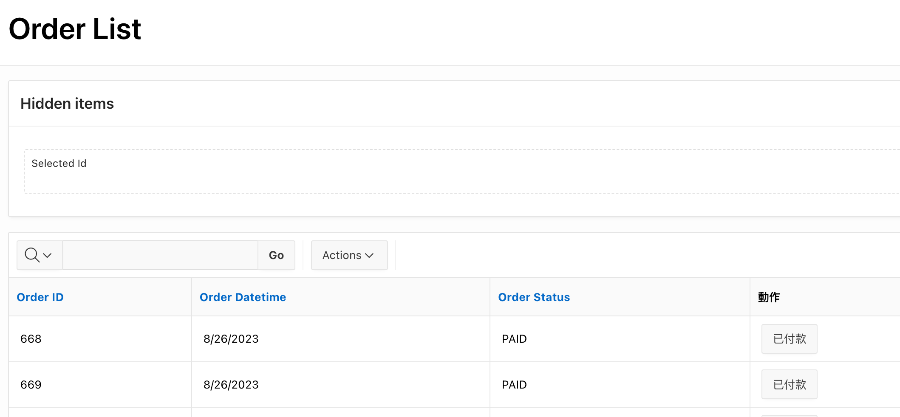

## S5: 針對 Click 事件, 建立 Dynamic Action

DA 的名稱:

- Identification > Name: Update order status

DA 執行設定:

- Execution
  - Event Scope: Dynamic

上述設定可讓 IR 在用 DA refresh 後, 點擊連結仍可繼續觸發 DA. 如果設定為 Static, 則 DA refresh IR 後，IR 上的連結就無法再觸發 DA。 

Ref: [https://forums.oracle.com/ords/apexds/post/dynamic-actions-not-firing-after-region-refresh-7146](https://forums.oracle.com/ords/apexds/post/dynamic-actions-not-firing-after-region-refresh-7146)

DA 的觸發條件:

- When 
  - Event: Click
  - Selection Type: jQuery Selector
  - jQuery Selector: `.order-paid`

在這個設定下, 只有當點擊的元素有 `.order-paid` 這個 class 時, 才會觸發 DA。


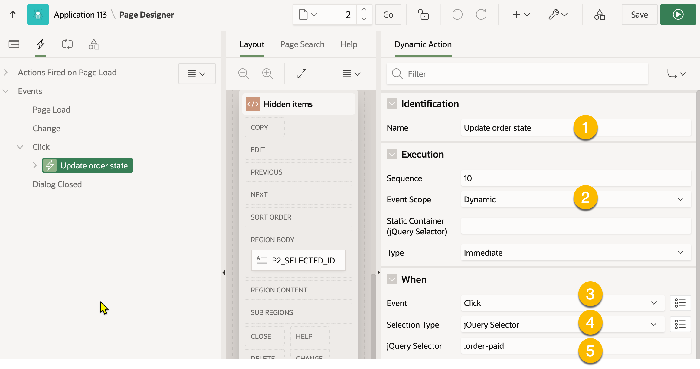

## S6: 建立第一個 True Action, 用來取得點擊元素的 `data-id` 屬性值並設定到 Hidden Item

Action 屬性的設定:
- Identification 
  - Name: Set selected order id item
  - Action: Set Value

- Settings (來源值)
  - Set Type: JavaScript Expression 
  - JavaScript Expression: `this.triggeringElement.dataset.id`

- Affected Elements (要設定的目標變數)
  - Selection Type: Item(s)
  - Item(s): P2_SELECTED_ID

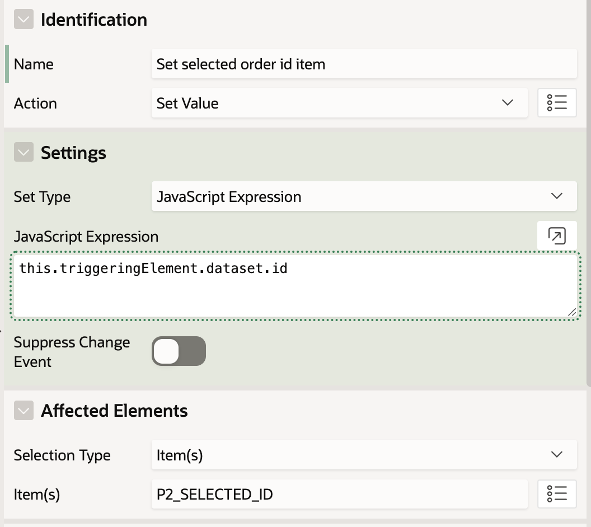

前述的設定中:

- `this.triggeringElement` 代表被點擊的 DOM 元素
- `element.dataset` 可取得元素的 `data-*` 屬性值
- `element.dataset.id` 取得 `data-id` 的值

## S7: 建立第二個 True Action, 用來執行 PL/SQL 程式

Action 屬性的設定:

- Identification
  - Name: update_order_state_sql
  - Action: Execute PL/SQL Code

- Settings
  - Language: PL/SQL
  - PL/SQL Code:
```sql
update orders
set ORDER_STATUS = 'PAID'
where order_id = :P2_SELECTED_ID;
```
  - Item to Submit: P2_SELECTED_ID

前述的設定中:
- 若沒有設定 `Item to Submit`, 則 PL/SQL 程式中的 `:P2_SELECTED_ID` 會是空值
- Orders 表中的 `ORDER_STATUS` 欄位的值有設定 Check Constraint, 只能是: 'CANCELLED','COMPLETE','OPEN','PAID','REFUNDED','SHIPPED' 這幾個值

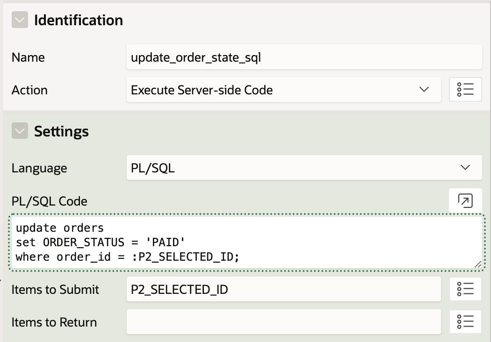

## S8: 建立第三個 True Action, 用來 Refresh IR Region

Action 屬性的設定:
- Identification
  - Name: Refresh Order IR
  - Action: Refresh

- Affected Elements:
  - Selection Type: Region
  - Region: Orders List (IR 的 Region Name)

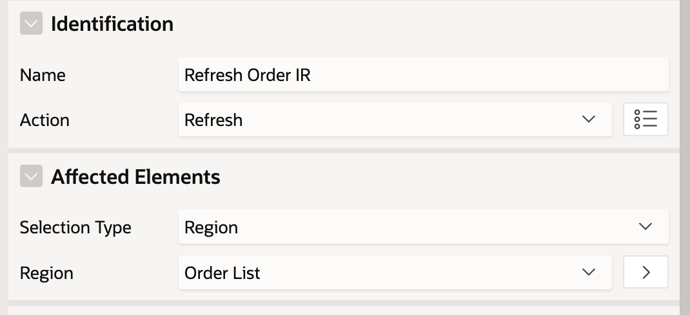

## S9: 測試

點擊 "已付款" 按鈕，應該可以更新資料庫中的 `ORDER_STATUS` 欄位的值, 並且更新訂單的 IR. 

