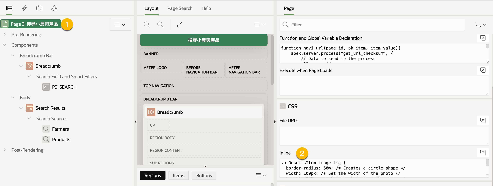

# Search Page

Oracle Apex Search Page 搜尋頁面提供像 Search Engine 的搜尋功能與結果。 使用者輸入關鍵字, Apex 會搜尋多個資料來源, 可能是資料庫表格, Query 做出的 View, 或是 REST data service 等, 並將結果顯示在頁面上。

## 1 技術原理

### 1.1 Search Configuration

在 Apex 中將搜尋資料來源封裝成 Search Configuration 的 shared component. 例如, 允許搜㝷產品與顧客資料表格, 為每個資料表各建立一個 Search Configuration.

在 Search Configuration 中, 可以設定搜尋的表欄位及結果顯示 HTML template, 如下圖的標示 2:


在頁面上, 使用 Search Region 元件, 連結到一個 Text Field 做為搜尋輸入, 連結到一個或多個 Search Configuration 做為搜尋來源。


參考: [16.9.8 Editing a Search Configuration, App Builder User's Guide](https://docs.oracle.com/en/database/oracle/apex/23.2/htmdb/editing-a-search-configuration.html#GUID-529D7840-ED8A-427B-B31F-94A79CAD92EC)

### 1.2 搜尋結果列的 HTML Template

在 Search Configuration 的 Default Result Row Template 設定顯示結果資料列的 HTML Template.

撰寫 Template 時，可使用 Substitutions 取得 Apex 的一些資訊, 或者使用 Template Directives 依據條件來顯示 HTML 元素。

Apex 提供的 Template 的包含有以下的元素及結構:

* ResultsItem
  * Icon and Display (initials, image, or icon class)
  * Content
    * Header
      * Title
      * Badge
    * Description
    * Attributes
    * Miscellaneous Data

要顯示的 Icon 及 Display 在 Search Configuration 的 `Icon and Display` Section 設定。 Content 的部份可以在 `Column Mapping` Section 設定。 也可以在 HTML Template 直接使用欄位名稱，使用 substitution 語法取得資料, 例如 `&ENAME.`。

Oracle Apex 會執行 [APEX\_SEARCH.SEARCH](https://docs.oracle.com/en/database/oracle/apex/23.2/aeapi/APEX\_SEARCH.SEARCH-Function.html) 函數執行查詢。 回傳的結果內容會由前述的 `Icon and Display` 及 `Column Mapping` 設定來決定。

在 HTML Template 要直接使用 `APEX_SEARCH.SEARCH` 回傳結果中的 `Icon and Display` 相關的欄位時, 使用以下的 Substitution:

* `ICON_TYPE`: Represents the icon type: Can be CLASS, URL or INITIALS.
* `ICON_VALUE`: The actual icon value, depending on the value of ICON\_TYPE
* `RESULT_CSS_CLASSES`: The CSS classes applied to each result, based on the Result CSS Classes attribute.
* `APEX$ORATEXT_SCORE`: Column representing the Oracle Text Score for Oracle Text search types.

以下是一個範例的 HTML Template:

```html
<!-- Result rwo -->
<div class="a-ResultsItem &RESULT_CSS_CLASSES!ATTR.">
  <!-- ICON: Initial, Image, or Icon -->
   <!-- ICON_VALUE, ICON_TYPE, INITIALS, URL, CLASS 皆為系統提供的 substitution -->
  {if ?ICON_VALUE/}
    {case ICON_TYPE/}
      {when INITIALS/}
        <!-- Initial -->
        <div class="a-ResultItem-initials u-color-var">&ICON_VALUE.</div>
      {when URL/}
      <!-- Image -->
        <div class="a-ResultItem-image"></div>
      {when CLASS/}
      <!-- Icon  -->
        <div class="a-ResultItem-icon u-color-var"><span class="fa &ICON_VALUE!ATTR." aria-hidden="true"></span></div>
    {endcase/}
  {endif/}
  <!-- Content -->
    <div class="a-ResultsItem-content">
        <!-- Header -->
        <div class="a-ResultsItem-header">
            <!-- Title -->
             <!-- 可製作 url 直接轉跳到特定 page -->
              <!-- APP_ID, SESSION 是 substitution  -->
            <span class="a-ResultsItem-title"><a href="f?p=&APP_ID.:&20:&SESSION.::::P20_EMPNO:&EMPNO.">&ENAME.</a>
            </span>
            <!-- Badge -->
             <!-- SAL 是 column name -->
            <span class="a-ResultsItem-badge">&SAL.</span>
        </div>
        <!-- Description -->
         <!-- RESUMEE 是 column name -->
        <div class="a-ResultsItem-description">&RESUMEE.</div>
        <!-- Attributes -->
        <div class="a-ResultsItem-attributes">
            <!-- COMM, JOB 是 column name -->
            {if ?COMM/}<span class="a-ResultsItem-attribute">&COMM.</span>{endif/}
            {if ?JOB/}<span class="a-ResultsItem-attribute">&JOB.</span>{endif/}
        </div>
        <!-- Miscellaneous data -->
         <!-- HIREDATE 是 column name -->
        <div class="a-ResultsItem-misc">&HIREDATE.</div>
    </div>
  </div>
```

注意, 若在 HTML Template 使用 f?p URL 語法產生頁面轉跳連結, 當有連結中會設定 item 的值時，f?p URL 需要提供 Checksum 值。這個 Checksum 值必需從後端產生。

### 1.3 Template Directives

Template Directives provide control over how substitution strings and content is processed.

Template Directives can also be used to build dynamic, reusable templates, which can then be applied in HTML Expressions anywhere in APEX.

Template directive 的進一步使用可參考 [Template Directives, Universal Theme](https://apex.oracle.com/pls/apex/r/apex\_pm/ut/template-directives).


### 1.4 CLOB 轉 varchar2

Search Configuration 不支援 clob 欄位使用 substitution 在 HTML Template 顯示。 必須將 clob 轉成 varchar2 才可以。

使用 [`dbms_lob.substr()`](https://docs.oracle.com/en/database/oracle/oracle-database/19/arpls/DBMS\_LOB.html#GUID-F0F5D13A-C86C-4BC2-8394-8CBA3344D5CE) 函數將 clob 轉成 varchar2。

`lob_loc` 參數可以是 BLOB, CLOB, 或 BFILE。

函數的簽名如下:

```sql
DBMS_LOB.SUBSTR (
   lob_loc     IN    BLOB,
   amount      IN    INTEGER := 32767,
   offset      IN    INTEGER := 1)
  RETURN RAW;

DBMS_LOB.SUBSTR (
   lob_loc     IN    CLOB   CHARACTER SET ANY_CS,
   amount      IN    INTEGER := 32767,
   offset      IN    INTEGER := 1)
  RETURN VARCHAR2 CHARACTER SET lob_loc%CHARSET;

DBMS_LOB.SUBSTR (
   file_loc     IN    BFILE,
   amount      IN    INTEGER := 32767,
   offset      IN    INTEGER := 1)
  RETURN RAW;
```

## 2 Use Case

使用者在頁面上輸入關鍵字，搜尋產品或小農的資料。


小農的結果列顯示小農的照片; 產品的顯示 icon。

搜尋結果列的 Title 提供連結到產品或小農的詳細資料頁面，頁面設定為唯讀。

## 3 實作示範

### 3.1 資料表格

假設存在 `app_products` 與 `app_farmers` 兩個資料表格, 用來存放產品與小農的資料。

`app_products` 資料表格結構如下:

```
Name               Null?    Type               
------------------ -------- ------------------ 
ID                 NOT NULL NUMBER             
FARMERS_ID                  NUMBER             
PR_NAME                     VARCHAR2(200 CHAR) 
THE_DESC                    CLOB               
UNIT                        VARCHAR2(200 CHAR) 
QUANTITY                    VARCHAR2(200 CHAR) 
PLANT_START_MONTH           DATE               
PLANT_END_MONTH             DATE               
ORIGIN                      VARCHAR2(100 CHAR) 
FAR_NAME                    VARCHAR2(200 CHAR) 
UNIT_PRICE                  NUMBER      
```

`FARMERS_ID` 是外來鍵，參考 `app_farmer` 的 `ID` 欄位。

`app_farmer` 資料表格結構如下:

```
Name               Null?    Type               
------------------ -------- ------------------ 
ID                 NOT NULL NUMBER             
FAR_NAME                    VARCHAR2(20 CHAR)  
ADDRESS                     VARCHAR2(400 CHAR) 
PHONE                       VARCHAR2(20 CHAR)  
EMAIL                       VARCHAR2(255 CHAR) 
PHOTO                       BLOB               
ATTACH_MIMETYPE             VARCHAR2(255)      
ATTACH_FILENAME             VARCHAR2(255)      
ATTACH_LAST_UPDATE          DATE               
ATTACH_CHARSET              VARCHAR2(128)      
```

### 3.2 建立維讀資料表單，顯示產品與小農的資料

使用 Wizard 為 `app_products` 與 `app_farmers` 各建立一個表單。

設定表單的 `Read Only` 的條件為:

* Type: Request = Value
* Value = `VIEW`


當轉跳至這些頁面時，若 url 中的 `REQUEST` 參數為 `VIEW` 時，表單將以唯讀模式顯示。

### 3.3 建立小農的 Search Configuration

路徑: App > Shared Components > Navigation and Search > Search Configurations

新增 Search Configuration. 要設定資料來源(Source), 搜尋欄位(Searchable columns), 樣版與欄位對應(Column Mapping), 顯示的 Icon 或 Display, 及轉跳的連結(link)。

#### 3.3.1 資料來源及搜尋欄位

使用 Local Database 的 `APP_FARMERS` 資料表格。


搜尋欄位: FAR\_NAME, ADDRESS, PHONE, EMAIL


#### 3.3.2 Column Mapping

設定使用預設樣版時的欄位對應。


#### 3.3.3. Icon and Display

資料列上顯示小農的照片.


這裡可以設定 Default Result Row Template, 但我們不設定，使用預設的樣版。

#### 3.3.4 轉跳連結

轉跳至相同應用程式的 `app_farmers` 頁面 (假設為 P2), 並設定 `REQUEST` 參數為 `VIEW`, 以啟動表單的唯讀模式。 轉跳時，將頁面的 `P2_ID` item 設定為小農的 `ID` 表格欄位值, 以顯示特定小農的資料。 頁面中的 `Initialize form` process 會根據 `P2_ID` item 的值, 抓取對應的小農資料, 並顯示在表單上。


### 3.4 建立產品的 Search Configuration

路徑: App > Shared Components > Navigation and Search > Search Configurations

新增 Search Configuration, 依序將設定: 資料來源(Source), 搜尋欄位(Searchable columns), 樣版與欄位對應(Column Mapping), 顯示的 Icon 或 Display.

#### 3.4.1 資料來源

Data Source: Local Database Source Type: SQL Query

```sql
select p.id, farmers_id, 
        pr_name, 
       plant_start_month, 
       plant_end_month,
       origin, 
       dbms_lob.substr(the_desc, 2000, 1) as prod_desc,
       f.far_name
    from app_products p join app_farmers f on p.farmers_id = f.id;
```

Searchable columns: pr\_name, origin, far\_name, prod\_desc


上述 Query 中, `the_desc` 是 CLOB 欄位, 使用 `dbms_lob.substr()` 函數將其轉成 varchar2, 以便在 HTML Template 中使用。

#### 3.4.2 Column Mapping

* Primary Key Column: ID&#x20;
* Title Column: PR\_NAME&#x20;
* Subtitle Column: ORIGIN&#x20;
* Description Column: PROD\_DESC&#x20;
* Badge Column: ORIGIN


#### 3.4.3 Icon and Display

使用特定的 ICON 標示產品資料列:

* Icon Source: Icon Class
* Icon CSS Classes: `fa-package`


#### 3.4.5 Default Result Row Template

自行設定 Row Template 顯示產品資料列。 點選 `Default Result Row Template` 下方的 ？ 按鈕，可以看到相關的說明，並提供一個範例的 HTML Template。


複製範例的 HTML Template, 並修改 Content 部份的內容:

```html
<div class="a-ResultsItem &RESULT_CSS_CLASSES!ATTR.">
  {if ?ICON_VALUE/}
    {case ICON_TYPE/}
      {when INITIALS/}
        <div class="a-ResultItem-initials u-color-var">&ICON_VALUE.</div>
      {when URL/}
        <div class="a-ResultItem-image"></div>
      {when CLASS/}
        <div class="a-ResultItem-icon u-color-var"><span class="fa &ICON_VALUE!ATTR." aria-hidden="true"></span></div>
    {endcase/}
  {endif/}
  <!-- 需要修改的部份 -->
  <div class="a-ResultsItem-content">
    <div class="a-ResultsItem-header">
        <!-- 呼叫 自定的 navi_url() js 函數產生轉跳連結 -->
      <span class="a-ResultsItem-title"><a href="javascript:navi_url(4, 'P4_ID', &ID.)">
            &PR_NAME.</a></span>
      <span class="a-ResultsItem-badge">&ORIGIN.</span>
    </div>
    <div class="a-ResultsItem-description">&PROD_DESC.</div>
    <div class="a-ResultsItem-attributes">
        種植期間: 
      {if ?PLANT_START_MONTH/}<span class="a-ResultsItem-attribute">&PLANT_START_MONTH. 起</span>{endif/}
      {if ?PLANT_END_MONTH/}<span class="a-ResultsItem-attribute"> to &PLANT_END_MONTH. 迄</span>{endif/}
    </div>
    <div class="a-ResultsItem-misc"></div>
  </div>
</div>
```

css class 和顯示的值對應如下:

* `a-ResultsItem-title`: 產品名稱(PR\_NAME)
* `a-ResultsItem-badge`: 產品產地(ORIGIN)
* `a-ResultsItem-description`: 產品描述(PROD\_DESC)
* `a-ResultsItem-attribute`: 種植期間(PLANT\_START\_MONTH, PLANT\_END\_MONTH)

此外, 產品名稱的連結使用 javascript 函數 `navi_url()` 產生, 以便轉跳至產品的詳細資料頁面。

`navi_url()` 會呼叫自行建立的 Application Process 以取得含 Checksum 的 URL。 其參數依序如下:

* page\_id: 轉跳的頁面 ID
* pk\_item: 表單的 PK item 名稱
* item\_value: 表單的 PK item 值

例如 `navi_url(4, 'P4_ID', &ID.)` 會轉跳至應用程式的第 4 頁, 並將 `P4_ID` item 設定為產品的 `ID` 值。

我們不再設定 Search Configuration 的 Link, 因為我們自行產生轉跳連結。

### 3.5 建立 Search Page

使用 Wizard 建立 Search Page.

過程中選擇先前建立的兩個 Search Configuration.

頁面的結構如下, 包含一個 Text Field 及一個 Search Region 元件。


點選 Search Region 元件的 Attributes 屬性頁, 可以看到其所關聯到的 Search Page Item:


設定 Search as You Type 屬性可控制是否在使用者輸入時即時搜尋。

### 3.5.1 加入 `navi_url()` JS 函數的宣告到 Search Page

在頁面中加入 `navi_url()` 函數的宣告:

```js
function navi_url(page_id, pk_item, item_value){
    apex.server.process("get_url_checksum", {
        // Data to send to the process
        // x01, x02, x03 can be accessed by apex_application.g_x01, apex_application.g_x02, apex_application.g_x03 respectively in the Apex application process.
        x01: page_id,
        x02: pk_item,
        x03: item_value
      }, {
        // Options
        success: function(data) {
          // Handle success
          // data is the returned URL with checksum
          console.log("Process completed successfully", data);
          // navigate to the product page
            window.location.href = data
        },
        error: function(jqXHR, textStatus, errorThrown) {
          // Handle error
          console.error("Error calling process: ", textStatus, errorThrown);
        },
        dataType: "text" // Expected data type of the response. Could be "json", "html", etc.
      });
}
```


參考:

1. [apex.server.process, JSDoc: Namespace: server](https://docs.oracle.com/en/database/oracle/apex/23.1/aexjs/apex.server.html#.process)
2. [4.2 Global Variables, API Reference](https://docs.oracle.com/en/database/oracle/apex/23.2/aeapi/APEX\_APPLICATION-Global-Variables.html)

### 3.5.2 加入小農的照片的 CSS

在 Search Page 的 CSS > Inline 屬性頁加入以下的 CSS:

```css
.a-ResultsItem-image img {
  border-radius: 50%; /* Creates a circle shape */
  width: 100px; /* Set the width of the photo */
  height: 100px; /* Set the height of the photo */
  object-fit: cover; /* Ensures the image covers the area without being stretched */
}
```



### 3.6 測試

1. 在 Search Input box 輸入關鍵字, 按下 Enter 鍵, 搜尋結果會顯示在頁面上。
2. 小農的照片會顯示在結果列上。
3. 產品的結果列會顯示 icon, 並用自訂的 HTML Template 顯示產品的資料。


4. 點選產品名稱, 會轉跳至產品的詳細資料頁面, 並以唯讀模式顯示。 

## 4 附註: 建立 Application Process 回傳含 Checksum 的 URL

Path: App > Shared Components > Application Processes

Process 設定:

* Process Name: get\_url\_checksum
* Process Point: Ajax Callback
* Source:

```sql
declare
  -- get the parameters sent from the JavaScript function (ajax call)
  l_page_id varchar2(100) := apex_application.g_x01;
  l_pk_item varchar2(200) := apex_application.g_x02;
  l_product_id varchar2(100):= apex_application.g_x03;
  l_target varchar2(2000);
begin
  -- generate url by calling apex_page.get_url function
  -- The apex_page.get_url function returns a URL that includes a checksum for pages in the same workspace.
 l_target := apex_page.get_url(
     p_page => l_page_id,
     p_request => 'VIEW',
     p_items => l_pk_item,
     p_values => l_product_id
 );
 -- response the url with checksum
 htp.p(l_target);

end;
```
