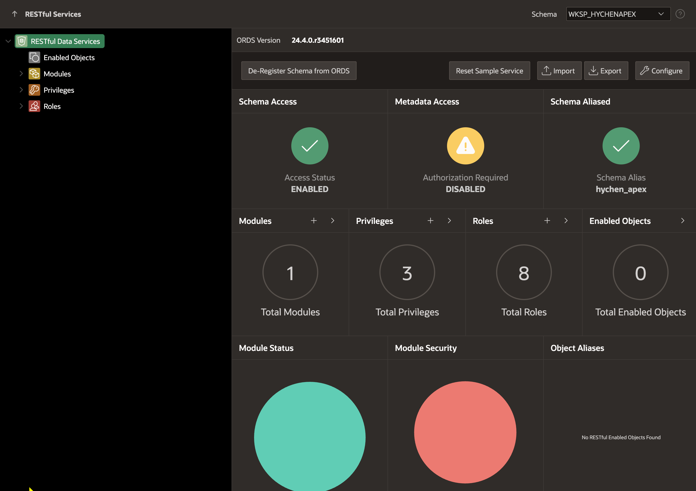
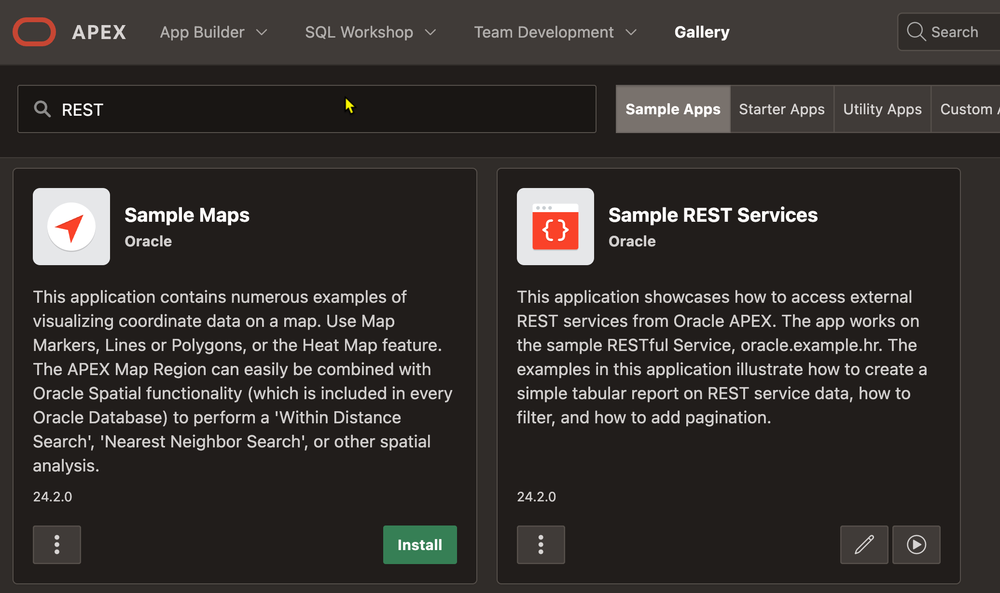
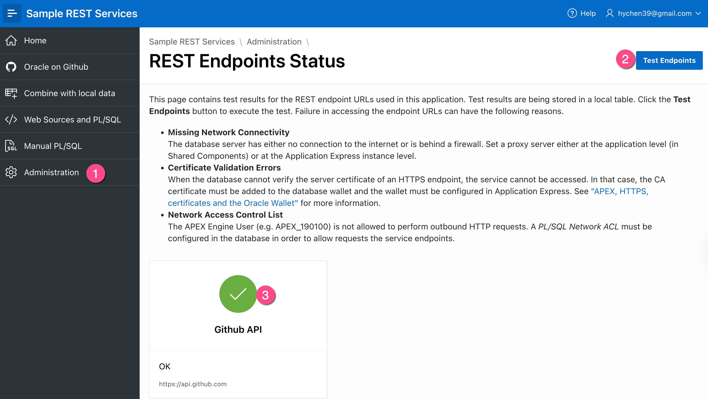
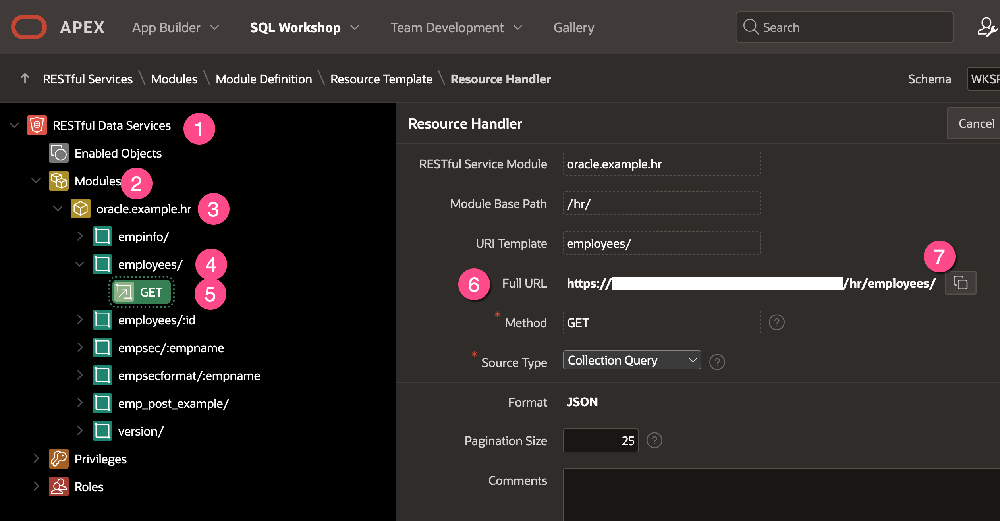
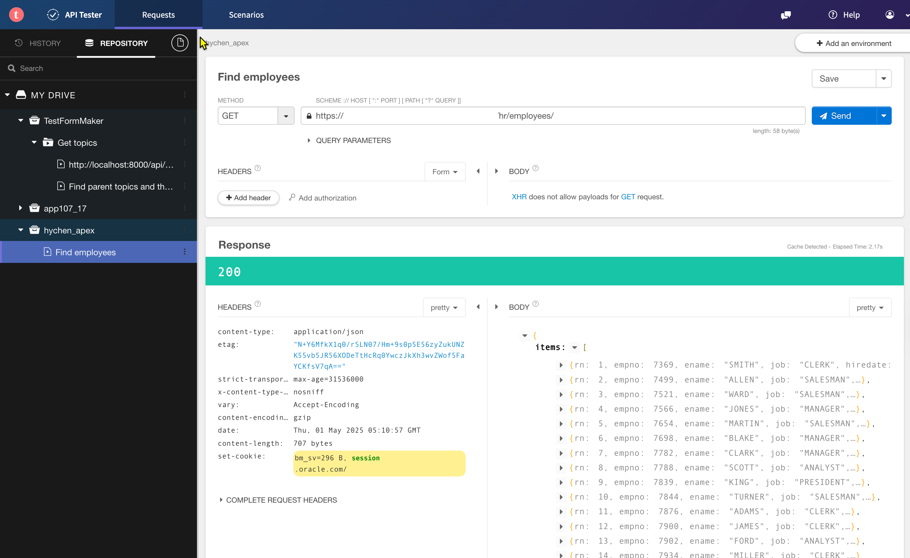

# 啟用 Apex 中的 REST 服務

## 概述

啟用 Apex 中的 REST 服務

使用 apex.oracle.com 提供的 workspace

## Register Schema with ORDS 

將你的 schema 註冊到 ORDS 中, 才能在 workspace 中使用 REST 服務

### S1. 登入你的 apex workspace
登入 apex.oracle.com, 進入你的 workspace。

### S2. 註冊 schema 到 ORDS 中
在 Apex 首頁, 路徑 SQL Workshop > RESTful Data Service

點選 (B)[Register Schema with ORDS] 進行註冊。

成功後會出現 RESTful Data Service 的 Dashboard 畫面。

安裝過程可選擇 Install Sample App 的選項, 會安裝 "Sample REST Services" 的範例 APP。

若沒有安裝, 從 Apex 首頁, 瀏覽: Gallery > Sample Applications > 搜尋: REST 
即可找到 "Sample REST Services" 的範例 APP. 之後, 點選 Install 按鈕, 安裝到你的 workspace 中。

## 測試 Workspace 中的 RESTful Service

使用 Sample REST Services APP 提供的功能, 測試 RESTful Service 是否正常運作。

S1. 執行 Sample REST Services APP

S2. 在 Sample REST Services 中, 路徑 Administration > Test Service Endpoint
點頁面右上角的 (B)[Test Endpoints]。 若設定正確, 下方的 Github API 圖示會顯示打勾

## 使用 API Tester 測試 RESTful Service

### S1. 安裝 Chrome 擴充套件  

安裝 Chrome 擴充套件 [Talend API Tester](https://chromewebstore.google.com/detail/talend-api-tester-free-ed/aejoelaoggembcahagimdiliamlcdmfm?hl=zh-TW), 進行 RESTful Service 測試。

### S2. 找到員工查詢的端口(Endpoint). 

在 Apex 首頁, 路徑 SQL Workshop > RESTful Services

在左側的 RESTful Services 的導覽面版中，點選  Modules > oracle.example.hr > employees/ > GET

複製右側的 Full URL. 

### S3. 新增 Talend API Tester 的專案及請求(request)測試

在 Talend API Tester 中, 點選左下角的 (B)[+ Project], 新增專案, 輸入專案名稱。

在專案名稱的快捷選單中, 點選 (B)[+ Add a request], 新增測試。

在請求測試中, 輸入:
- METHOD: GET
- URL: 先前複製的 Full URL

完成後, 點選 (B)[Save] 儲存請求測試。

### S4. 執行請求測試

在請求測試中, 點選 (B)[Send] 按鈕, 執行請求測試。

下方會顯示回覆的 http response, 包含 header 與 body 的內容。

