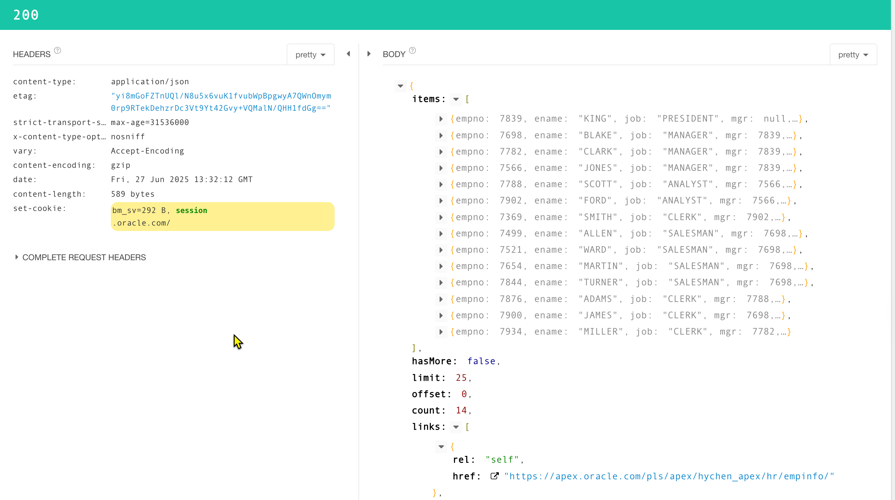

# HTTP GET 取得資料

Podcast: [HTTP GET 取得資料 - Podcast on Firstory](https://open.firstory.me/story/cmcf04l7x05rq01zc97na4fya)

## Use Cases 

### 取得所有員工資料

使用 HTTP GET 方法向 Oracle Apex 取得所有員工的編號及姓名。
開放的 RESTful API 端點: hr/empinfo/

### 取得特定員工資料

使用 HTTP GET 方法向 Oracle Apex 取得特定員工的資料，如編號為 100 的員工。

#### 技術 1: 使用 URL 路徑參數傳遞員工編號。

開放的 RESTful API 端點: hr/empinfo/100

員工編號放在 URL 中做為參數 (url path parameter)

#### 技術 2: 使用查詢參數傳遞員工編號。

開放的 RESTful API 端點: hr/empinfo/?emp_id=100

## Demo App 

在 Oracle Apex 中安裝 Sample REST Service.


## 取得所有員工資料

### 設定 

欲開放的 RESTful API 端點: `hr/empinfo/`

在 Apex 的 RESTful Services 下，先建立一個 REST Module。
之後，要設定 Module 的 Base Path, 例如: `hr`

在 Module 中建立一個 resource template, 並設定 template 的 URI Template, 例如: `empinfo/`

之後, 在 resource template 下建立一個 Resource Handler, 並設定 Handler 的參數:

- Method: GET
- Source Type: Collection Query (因為會回傳多筆資料)

接著, 在 Source 欄位輸入要執行的 SQL 查詢語句，例如:

```sql
select * from emp
```


### Oracle ORDS 會做什麼事？

Oracle ORDS 將查詢的結果自動分頁，預設一次回傳 25 筆資料。

接著，Oracle ORDS 會將查詢結果轉換成 JSON 格式，並回傳給客戶端。

資料的回傳格式如下： TBD

```json
{
    "items": [
        {
            "empno": 7839,
            "ename": "KING",
            ...
        },
        {...},
        {...},
        ...
    ],
    "hasMore": false,
    "limit": 25,
    "offset": 0,
    "count": 14,
    "links": [
        {
            "rel": "self",
            "href": "https://apex.oracle.com/pls/apex/hychen_apex/hr/empinfo/"
        },
        {
            "rel": "describedby",
            "href": "https://apex.oracle.com/pls/apex/hychen_apex/metadata-catalog/hr/empinfo/"
        },
        {
            "rel": "first",
            "href": "https://apex.oracle.com/pls/apex/hychen_apex/hr/empinfo/"
        }
    ]
}

```

以下是 JSON 欄位的解釋：

### `items`
- **內容**: 包含多筆員工資料的陣列，每筆資料是一個物件。
  物件內的欄位和資料表的欄位相同。

### `hasMore`
- **內容**: 是否有更多資料可供分頁。
- **值**: `false` 表示沒有更多資料。

### `limit`
- **內容**: 每次回傳的最大資料筆數。
- **值**: 預設為 `25`。

### `offset`
- **內容**: 分頁的起始位置。
- **值**: `0` 表示從第一筆資料開始。

### `count`
- **內容**: 總共回傳的資料筆數。
- **值**: `14` 表示目前回傳了 14 筆資料。

### `links`
- **內容**: 包含相關連結的陣列，每個連結是一個物件。
- **欄位**:
  - `rel`: 連結的類型，例如 `self` 表示目前的資源。
  - `href`: 連結的 URL。
    - `self`: 指向目前的資源。
    - `describedby`: 指向資源的描述文件。
    - `first`: 指向第一頁的資源。



## 取得特定員工資料

### 設定

欲開放的 RESTful API 端點: `hr/empinfo/{emp_id}`

在 URL 中 `{emp_id}` 是路徑參數。
使用綁定變數(bind variable) 來接收路徑參數.

上述的 API 端點將被改寫為 `hr/empinfo/:id`

所以，先建立一個 Resource Template, 並設定 URI Template 為 `empinfo/:id`

在此 Resource Template 下建立一個 Resource Handler, 並設定 Handler 的參數:

- Method: GET
- Source Type: Collection Query Item (因為只要回傳單筆資料)

接著, 在 Source 欄位輸入要執行的 SQL 查詢語句，例如:

```sql
select * from emp where empno = :id
```

我們可以在 SQL 查詢語句中使用綁定變數 `:id` 來接收路徑參數。

例如，當我們訪問 `hr/empinfo/100` 時，Oracle ORDS 會將 `:id` 替換為 `100`。

### Oracle ORDS 會做什麼事？

處理 GET 請求時，Oracle ORDS 會將路徑參數存儲在綁定變數中。例如，當請求為 `hr/empinfo/100` 時，Oracle ORDS 會將 `100` 存儲在綁定變數 `:id` 中。

之後，我們便可以在 SQL 查詢語句中使用這個綁定變數來查詢特定的員工資料。

Oracle ORDS 接著將產生的結果轉換成 JSON 格式，並回傳給客戶端。

當查詢 `empinfo/7839` 時，回傳的 JSON 資料如下：

```json
{
    "empno": 7839,
    "ename": "KING",
    "job": "PRESIDENT",
    "mgr": null,
    "hiredate": "1981-11-17T00:00:00Z",
    "sal": 5000,
    "comm": null,
    "deptno": 10,
    "links": [
        {
            "rel": "collection",
            "href": "https://apex.oracle.com/pls/apex/hychen_apex/hr/empinfo/"
        }
    ]
}

```


若查詢的員工編號不存在，則會回傳 404 Not Found 錯誤，並在 response body 提供錯誤訊息 JSON 如下：

```json
{
    "code": "NotFound",
    "message": "Not Found",
    "type": "tag:oracle.com,2020:error/NotFound",
    "instance": "tag:oracle.com,2020:ecid/gpIzlHbEqGhY_81qvuhCTg"
}
```

## 使用 request parameters 傳遞參數

當查詢需要的參數較多無法放在 URL 路徑中時，可以使用查詢參數 (query parameters) 傳遞。

例如，查詢員工在部門編號大於或等於 30 且 commission 大於或等於 500 的員工資料。

```sql
select * from emp
where deptno >= 30 and comm >= 500;
```

此查詢有兩個參數 `deptno` 和 `comm`。

### 設定

欲開放的 RESTful API 端點: `hr/empcomm/`

找到 RESTful Services 下的 Module，建立一個新的 Resource Template，並設定 URI Template 為 `empcomm/`

在此 Resource Template 下建立一個 Resource Handler，並設定 Handler 的參數:

- Method: GET
- Source Type: Collection Query (因為會回傳多筆資料)


接著，在 Source 欄位輸入要執行的 SQL 查詢語句，例如:

```sql
select * from emp
where deptno >= :deptno and comm >= :comm
```

其中 `:deptno` 和 `:comm` 是綁定變數。

接著在 Handler 下方的 Parameters 區域新增兩列，以設定請求參數與綁定變數的對應關係。

- 第一列:
  - Name: `p_deptno`
  - Bind Variable: `deptno`
  - Access Method: IN (表示此參數是輸入參數)
  - Source Type: URI (表示此參數來自 URL 路徑上的查詢參數)
  - Data Type: Number (ORDS 會自動將此參數轉換為數字類型)
- 第二列:
  - Name: `p_comm`
  - Bind Variable: `comm`
  - Access Method: IN
  - Source Type: URI (表示此參數來自 URL 路徑上的查詢參數)
  - Data Type: Number (ORDS 會自動將此參數轉換為數字類型)


### Oracle ORDS 會做什麼事？

當客戶端發送 GET 請求時，Oracle ORDS 會自動解析 URL 中的查詢參數，並將其存儲在對應的綁定變數中。

例如，當請求為 `hr/empcomm/?p_deptno=30&p_comm=500` 時，Oracle ORDS 會將 `p_deptno` 的值 `30` 存儲在綁定變數 `deptno` 中，將 `p_comm` 的值 `500` 存儲在綁定變數 `comm` 中。

接著，Oracle ORDS 會執行 SQL 查詢，並將結果轉換成 JSON 格式，回傳給客戶端。


執行結果如下:


## 總結

在本章中，我們介紹了:
- 介紹如何用 Oracle Apex RESTful API 以 HTTP GET 取得所有或特定員工資料。
- 說明路徑參數與查詢參數的設定方式。
- 展示 ORDS 自動分頁、JSON 格式回傳與錯誤處理。

## 參考資料

- [ORDS and Source Types, That Jeff Smith](https://www.thatjeffsmith.com/archive/2019/02/ords-and-source-types/)
