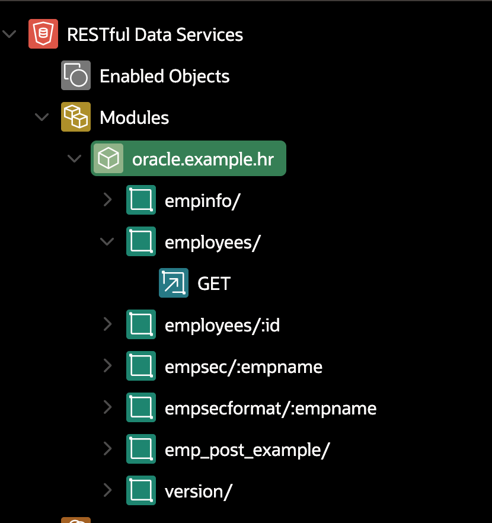

# Oracle ORDS 介紹

介紹 Oracle ORDS 的觀念

## 什麼是 Oracle ORDS

- ORDS = Oracle Rest Data Service
- 為 Table 及 View 提供  Restful service

More Info: [Oracle REST Data Services - REST APIs for Oracle Database @ THAT JEFF SMITH](https://www.thatjeffsmith.com/oracle-rest-data-services-ords/)

ORDS 的架構 

Src: https://www.oracle.com/technetwork/developer-tools/apex/learnmore/apex-ebs-extension-white-paper-345780.pdf

## APEX 中的 REST module 的結構與 Endpoint URL 的結構

### REST Module 的結構 

Apex 中的 RESTful Data Service 使用 Module 來區分不同服務。

- 一個 Schema (RESTful Data Service) 下可有多個 Module。
- 一個 Module 可以有多個 Resource Template 
- 一個 Resource Template 下可有多個 Resource Handler

### Endpoint URL 的結構

ORACLE REST URL 結構:
`POST http://<HOST>/ords/<schema>/<module_prefix>/<resource_uri>`

-  schema: DB Schema 的名稱
-  module_prifix: modules 的 URI 前置(URI prefix)符號
-  resource_uri: resource template 的 URI Pattern

### Module, Resource Template 與 Resource Handler 

- Module: 是一組 Endpoint 的集合, 通常對應到一個應用程式中的服務
  - 例: 針對某個 schema 的 tables 提供 CRUD 的服務
- Resource Template: 在 Module 下定義的一個資源, 通常對應到一個資料表或 View
  - 例: 針對某個 `employees` 的資料表提供 CRUD 的服務
- Resource Handler: 在 Resource Template 下定義的具體的操作, 通常對應到一個 HTTP 方法
  - 例: 使用 `GET` 方法來獲取資料
  
不同層級元件的 Full URL 欄位提供該元件的完整 URL

