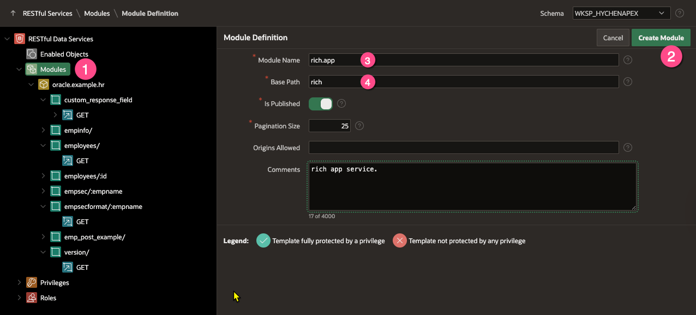
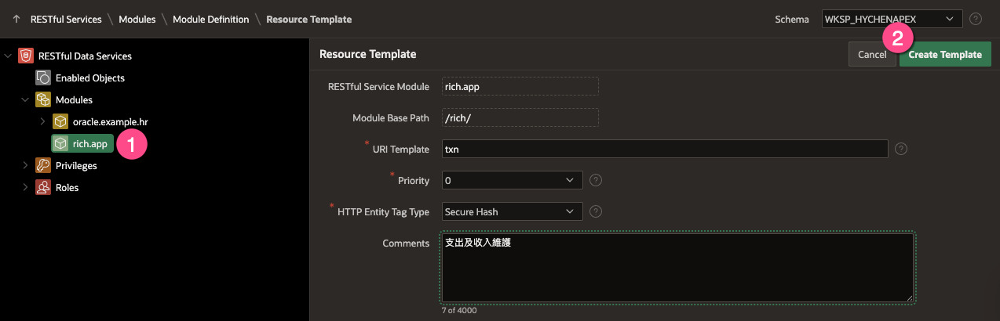
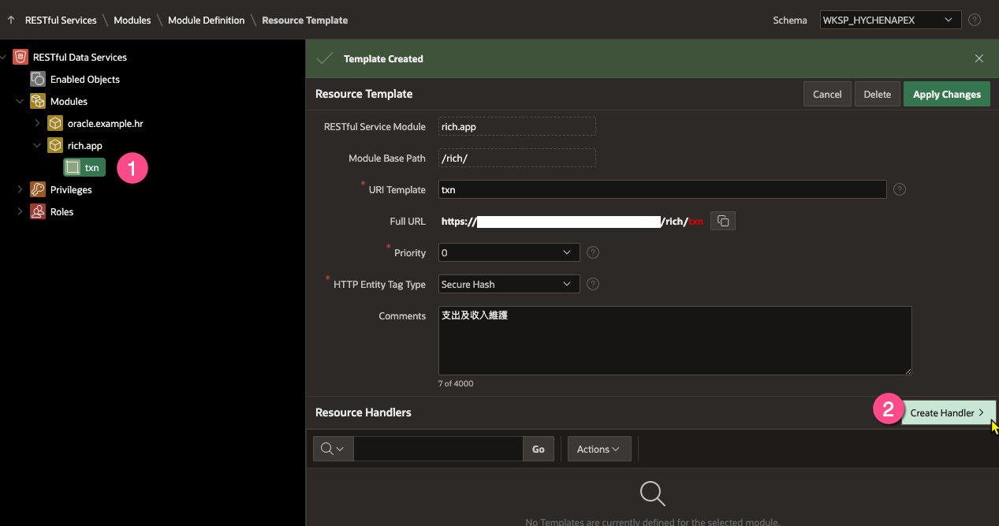
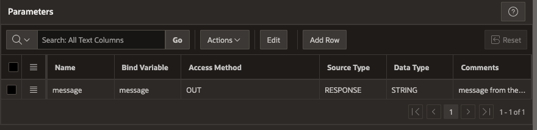
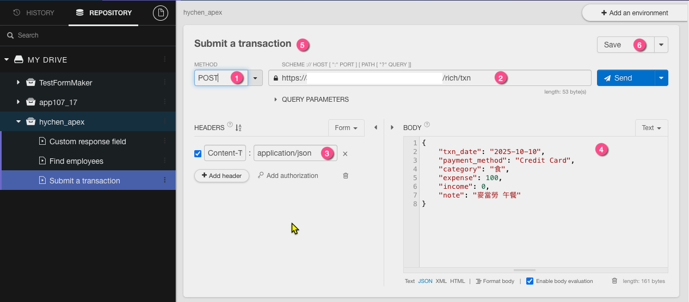
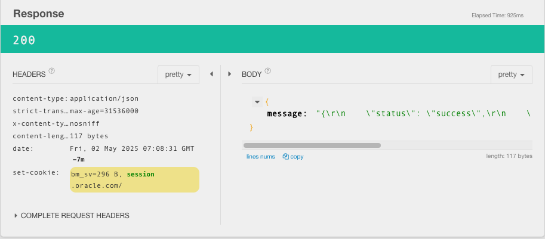

# 示範: 處理 REST API POST 請求

## 簡介

Schema 中有 transactions 表格, 這個表格有以下欄位:

```
Name           Null?    Type               
-------------- -------- ------------------ 
ID             NOT NULL NUMBER             
TXN_DATE                DATE               
PAYMENT_METHOD          VARCHAR2(20 CHAR)  
CATEGORY                VARCHAR2(20 CHAR)  
EXPENSE                 NUMBER             
INCOME                  NUMBER             
NOTE                    VARCHAR2(200 CHAR) 
```

現有一筆交易資料, 需要將這筆資料寫入 transactions 表格中, 這筆資料的格式為 JSON 格式, 例如:

```json
{
    "txn_date": "2025-10-10",
    "payment_method": "Credit Card",
    "category": "食",
    "expense": 100,
    "income": 0,
    "note": "麥當勞 午餐"
}
```

## 步驟

### 撰寫 Package procedure  能將 JSON 資料寫入 transactions 表格中

S1. 建立套件 ap4_txn_pkg, 這個套件有一個 procedure, 這個 procedure 會將 JSON 資料寫入 transactions 表格中.


```sql
CREATE OR REPLACE PACKAGE ap4_txn_pkg AS
    /** 新增交易資料並回傳記錄主鍵 ID
     */
    FUNCTION insert_txn(p_json IN CLOB) return number;
END ap4_txn_pkg;
/

create or replace package BODY ap4_txn_pkg is
    FUNCTION insert_txn(p_json IN CLOB) return number IS
        l_id NUMBER;
        l_rec ap4_transactions%ROWTYPE;
    BEGIN
        select null, to_date(txn_date, 'yyyy-mm-dd'), payment_method, category, expense, income, note
          into l_rec
        from JSON_TABLE(
            p_json,
            '$'
            COLUMNS (
                txn_date VARCHAR2(20) PATH '$.txn_date',
                payment_method VARCHAR2(20) PATH '$.payment_method',
                category VARCHAR2(20) PATH '$.category',
                expense NUMBER PATH '$.expense',
                income NUMBER PATH '$.income',
                note VARCHAR2(200) PATH '$.note'
            )
        );

        insert into ap4_transactions
        values l_rec
        returning id into l_id;     

        return l_id;  
         
    END insert_txn;
end ap4_txn_pkg;
/

```

### 測試 Package procedure

```sql
declare
    l_json clob := q'!{"txn_date": "2025-10-01", 
                        "payment_method": "Credit Card", 
                        "category": "食", 
                        "expense": 100, 
                        "income": 0, 
                        "note": "麥當勞 午餐"}!';
    l_id number;
begin

    l_id := ap4_txn_pkg.insert_txn(l_json);
    commit;
    dbms_output.put_line('ID: ' || l_id);
end;
/

select * from AP4_TRANSACTIONS;
```


### 在 RESTful API 中, 建立新的模組 




### 在模組中, 建立新的 Resource Template



### 在 Resource Template 中, 建立新的 POST Handler



### 撰寫 Handler 的 PL/SQL 程式碼

```sql

declare
-- 取得 Request Body 的內容, text
l_body_text clob;
-- 存放 Content-Type
l_content_type varchar2(200);
-- Record 的 Primary Key
l_id number;
l_msg varchar2(2000);
begin

-- 或者取得 Text 的內容, :body 或 :body_text 只能兩者擇一, 並且只能使用一次
-- 應該是 JSON 格式的資料
l_body_text := :body_text;

-- Get the content type
l_content_type := :content_type;


-- 檢查內容是否為空, 如果是, 回傳錯誤訊息給客戶端
if l_body_text is null then
    :message := 'Request body is empty';
    :status_code := 400;
    return; 
end if;

-- 
-- call your procedure/function or package. 
--
l_id := ap4_txn_pkg.insert_txn(
    p_json => l_body_text);
    
l_msg := q'{{
    "status": "success",
    "id": #l_id#,
    "content_type": "#l_content_type#"
}}';

l_msg := replace(l_msg, '#l_id#', l_id);
l_msg := replace(l_msg, '#l_content_type#', l_content_type);

:message := l_msg;

-- 設定狀態碼
:status_code := 200;  

end;
```


### 在 Handler 中, 設定參數與 PL/SQL 綁定變數的對應關係


 

### 測試 POST 請求



下方可看到 Response status 及 Response Body 的內容



