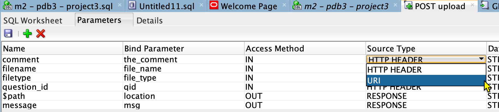
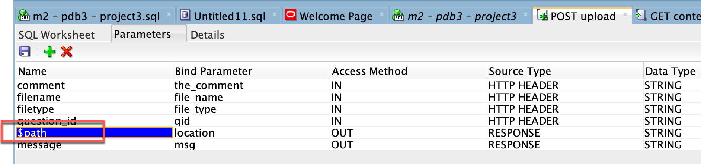
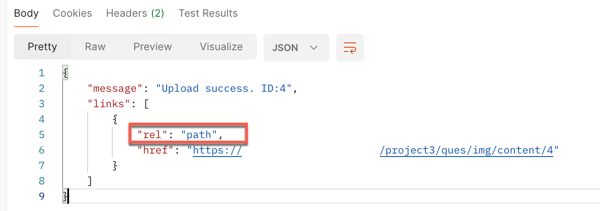
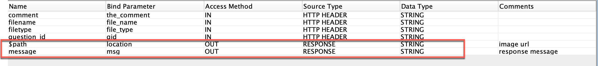
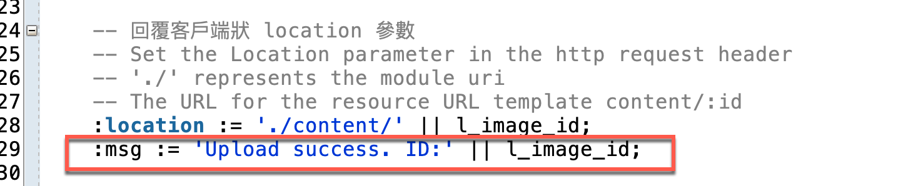
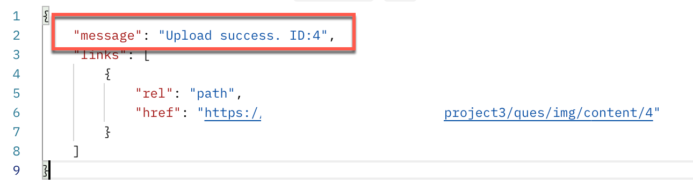
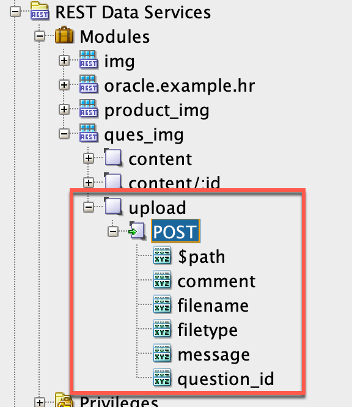
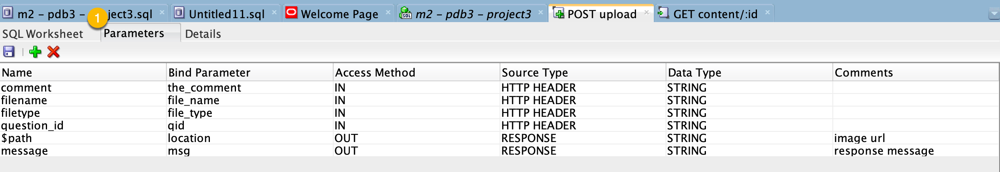
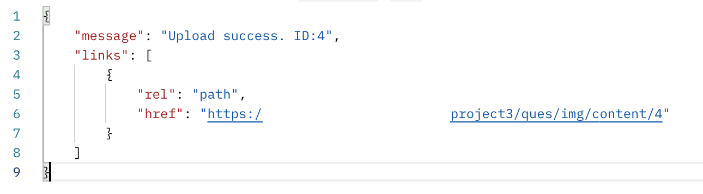

# Upload an image to a RESTful endpoint and return the URL

## Use Case

We want to upload an image to a RESTful endpoint and return the URL of the image.

When uploading, we need to provide the following information in the request header:

* filename: string
* filetype: string
* question\_id: string
* comment: string

In the request body, we need to provide the image file.

The response will be a JSON object with the following fields:

* message: string
* url: string - the URL of the image

## Concepts:

### RESTful module, template, and handler

Create a RESTful module in the database schema. In the module, we add an template with a POST handler to handle the request.

### Mapping between parameters and bind variables

When authoring the POST handler, we need to specify the mapping between the parameters and the bind variables used in the PL/SQL code.

We have several cases:

* URL Path parameters: the parameter is passed in the URL path with the syntax `:parameter_name`. For example, `project3/ques/img/content/:id`.
  * ORDS will automatically map the URL parameter to the bind variable as the same name.
* Query parameter: the parameter is passed in the query string with the syntax `?parameter_name=value`. For example, `project3/ques/img/content?id=1`.
  * The query parameter is mapped automatically to the bind variable with the same name (`:id`). \[1]
  * Or, we can explicitly specify the mapping in the POST handler. The source type is URI for the mapping. \[2]



* HTTP Header parameters: the parameter is passed in the request header.
  * We need to specify the mapping in the POST handler.
  * The source type is `HTTP HEADER` for the mapping.

### Special character `$`

在回傳的欄位名稱前或者參數名稱前加上 `$`, ORDS 會為其產生一個 URL 連結。\[3]

例如在欄位名稱前加上 `$`：


或者在參數名稱前加上 `$`：





### Create HTTP response

有兩種方法可以回傳 HTTP response。

The first method uses the `htp.p` or [`htp.print`](https://docs.oracle.com/en/database/oracle/oracle-database/19/arpls/HTP.html#GUID-E58CCF81-DAE0-482F-82BE-5A1500A7F3DF) procedure to output text directly to the HTTP response body.

Example: Create the response header and download a file:

```sql
  sys.HTP.init;
  -- Create the response header
  sys.OWA_UTIL.mime_header(l_mime_type, FALSE);
  sys.HTP.p('Content-Length: ' || DBMS_LOB.getlength(l_blob_content));
  sys.HTP.p('Content-Disposition: product_id="' || p_product_id || '"');
  sys.OWA_UTIL.http_header_close;
    -- Download the file
  sys.WPG_DOCLOAD.download_file(l_blob_content);
```

See more in \[4] and \[5].

If we don't want to create the response header and body by ourselves, the second way is to create the response parameters in the handler.

Create a parameter with the source type `RESPONSE`. Then, map the parameter to a bind variable in the PL/SQL code.

In the pl/sql, set a value to the bind variable. ORDS will automatically generate a JSON object that contains the field of the parameter name and the value assigned to the bind variable.



For example, we create a message parameter with the source type `RESPONSE` and map it to the bind variable `msg`.

&#x20;

<figure><figcaption></figcaption></figure>

We assign a value to the bind variable `msg` in the PL/SQL code:



The response will be a JSON object with the field `message` and the value assigned to the bind variable `msg`.



### Implicit bind variables in REST API

ORDS provides many implicit parameters (bind variables) used in REST Service handlers. \[6] provides the complete list.

Note that the implicit parameters are case-insensitive and have different access modes.

Often used implicit parameters include:

* `:body` - the request body with BLOB data type
* `:body_text` - the request body with CLOB data type
* `:content_type` - map the `Content-Type` header
* `:status_code` - Specifies the HTTP status code for the request.

## 實作

### Create the `bank_media` table

Create the `bank_media` table to store the image file.

```
Name        Null?    Type                
----------- -------- ------------------- 
ID          NOT NULL NUMBER              
QID                  VARCHAR2(100)       
FILENAME             VARCHAR2(4000 CHAR) 
MIME_TYPE            VARCHAR2(4000 CHAR) 
CHARSET              VARCHAR2(4000 CHAR) 
LAST_UPDATE          DATE                
CONTENT              BLOB                
THE_COMMENT          VARCHAR2(4000 CHAR) 
```

### Create a REST module `ques_img` and a template

Firstly, we create the REST module by the Oracle SQL Developer.

Path: REST Data Services > Modules > New Module

* Module Name: ques\_img
* URI Prefix: /ques/img
* Publish: Check

Secondly, add a template to the module:

* URI Pattern: `upload`

The complete URI for the template is `/ques/img/upload`.

### Add a POST handler to the template

Thirdly, add a POST handler to the template.



The handler contains four IN and two OUT parameters. The four IN parameters are about the uploading image are passed in the request header. The two OUT parameters are the JSON field in the JSON object for the response.

Navigate to the `Parameters` tab in the handler to set these parameters and their mapping to the bind variables.



Fourthly, write the PL/SQL code in the handler.

The PL/SQL code inserts the image file into the `bank_media` table and returns its URL.

The first step is to get the image file from the request body. The image file is placed in the `:body` implicit parameter. We save it to the `l_body` local variable.

The second step is to insert the image file into the `bank_media` table. We use the `insert into` statement to insert the image file. The `RETURNING` clause returns the `id` of the inserted row. We save the `id` to the `l_image_id` local variable. Within the INSERT statement, we use the `:qid`, `:file_name`, `:file_type`, and `:the_comment` bind variables which comes from the request header parameters.

Thirdly, we set the HTTP status code to 201 and the Location parameter to the URL of the image.

Finally, we set the response message in the `:msg` bind variable and the url to access the image in the `:location` bind variable. The two bind variables are mapped to the OUT response parameters in the handler.

```sql
declare
    l_image_id number :=0;  
    l_url varchar2(2000);
    l_body blob;
    l_err_msg VARCHAR2(2000);
    l_response varchar2(2000);
begin
    -- uploaded file is placed in the body.
    -- Restful service does not support the multipart/form-data protocol
    -- Get the image file from the request body
    -- The :body implicit parameter must be dereferenced exactly once in a PL/SQL block. If it is dereferenced more than once, then the second and subsequent dereferences will appear to be empty. 
    -- See [6]
    l_body := :body;

    -- :file_name, :file_type are defined in the parameter panel.
    -- :qid, :the_comment
    insert into bank_media(qid, filename, mime_type, last_update, content, the_comment)
             values  (:qid, :file_name, :file_type, sysdate, l_body, :the_comment)
             RETURN id into l_image_id;
    commit;

    -- 回覆客戶端狀態碼
    -- http status code that is defined in the parameter panel.
    -- :status is an implicit parameter
    :status := 201; 

    -- 回覆客戶端狀 location 參數
    -- Set the Location parameter in the http request header
    -- './' represents the module uri
    -- The URL for the resource URL template content/:id
    :location := './content/' || l_image_id; 
    :msg := 'Upload success. ID:' || l_image_id; 

exception
    WHEN OTHERS then
        l_err_msg := sqlerrm;
        -- 回覆客戶端例外訊息
        htp.print(l_err_msg);
end;
```

The response JSON object will be like this:



## Conclusion

The takeaway points from this article include:

* The structure of the RESTful module, template, and handler.
* Mapping between parameters and bind variables.
  * types of parameters: URL path, query, and HTTP header.
* The special character `$` to generate a URL link.
* The implicit parameters in the REST API used in the handler.
* Write a handler to accept the POST request, insert the image file into the database, and return the URL of the image.

## References

1. [A Tale of Two Styles of URIs and Parameters w/ORDS](https://www.thatjeffsmith.com/archive/2017/03/a-tale-of-two-styles-of-uris-and-parameters-words/)
2. [REST API: Query Parameter values to a SQL WHERE IN (:list)](https://www.thatjeffsmith.com/archive/2023/11/rest-api-query-parameter-values-to-a-sql-where-in-list/)
3. [Generating Links in your Oracle REST API HTTPS Responses](https://www.thatjeffsmith.com/archive/2017/05/ords-restful-services-and-uri/)
4. [Database Development Guide](https://docs.oracle.com/en/database/oracle/oracle-database/23/adfns/web-applications.html#GUID-5162BCA5-E622-4C6D-AD24-7D6FDAF10516)
5. [Oracle REST Data Services (ORDS) : HTTP Headers (OWA\_UTIL) and ORDS-Specific Bind Variables](https://oracle-base.com/articles/misc/oracle-rest-data-services-ords-http-headers-and-ords-specific-bind-variables#google\_vignette)
6. [3 Implicit Parameters, Developer's Guide](https://docs.oracle.com/en/database/oracle/oracle-rest-data-services/23.1/orddg/implicit-parameters.html#GUID-E7716042-B012-4E44-9F4C-F8D3A1EDE01C)
